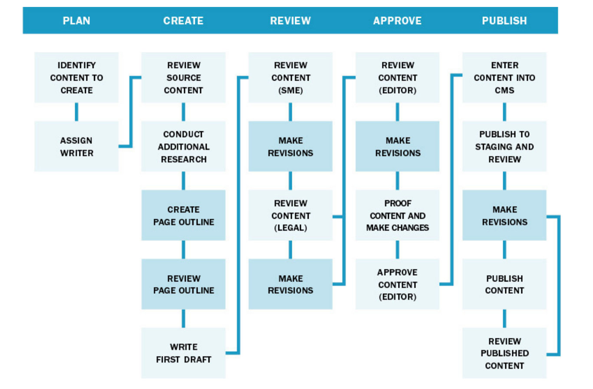
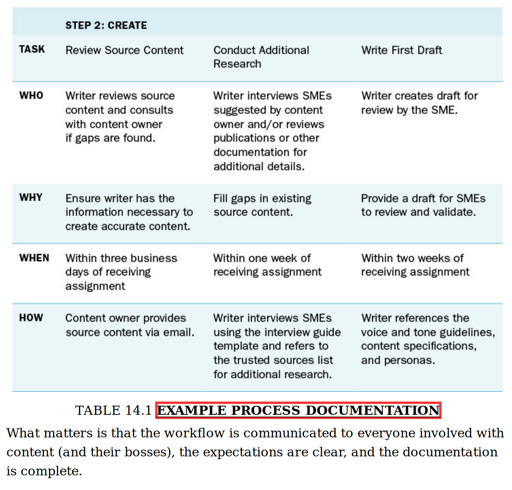

---
references:
- id: blobaumRedaktionsorganisationJournalistikon
  accessed:
    - year: 2021
      month: 11
      day: 10
  author:
    - family: Blöbaum
      given: Bernd
  title: Redaktionsorganisation | Journalistikon
  type: post-weblog
  URL: https://journalistikon.de/category/redaktionsorganisation/

- id: caseyContentStrategyToolkit2015
  abstract: >-
    In this essential guide, Meghan Casey outlines a step-by-step approach for
    doing content strategy, from planning and creating your content to
    delivering and managing it. Armed with this book, you can confidently tackle
    difficult activities like telling your boss or client what’s wrong with
    their content, getting the budget to do content work, and aligning
    stakeholders on a common vision. Reading The Content Strategy Toolkit is
    like having your own personal consulting firm on retainer with a complete
    array of tools and tips for every challenge you’ll face. In this practical
    and relevant guide, you’ll learn how to: Identify problems with your content
    and persuade your bosses it’s worth the time and resources to do it right
    Make sense of your business environment and understand your audience Get
    stakeholders aligned on business goals and user needs Set your content
    strategy and decide how to measure success Create, maintain, and govern
    on-strategy content You’ll learn to control your content–and not have it
    control you.
  author:
    - family: Casey
      given: Meghan
  edition: 1st edition
  event-place: San Francisco, California
  ISBN: 978-0-13-410510-9
  issued:
    - year: 2015
      month: 6
      day: 15
  language: English
  number-of-pages: '288'
  publisher: New Riders
  publisher-place: San Francisco, California
  title: >-
    The Content Strategy Toolkit: Methods, Guidelines, and Templates for Getting
    Content Right
  title-short: The Content Strategy Toolkit
  type: book

- id: kissaneElementsContentStrategy2011
  abstract: Literaturverz. und Linksammlung S. 76 - 79
  author:
    - family: Kissane
      given: Erin
  call-number: ST 252 K618
  collection-title: Brief books for people who make websites
  event-place: New York, NY
  ISBN: 978-0-9844425-5-3
  issued:
    - year: 2011
  language: eng
  number-of-pages: '81'
  publisher: A Book Apart
  publisher-place: New York, NY
  source: search-fhj.obvsg.at
  title: The elements of content strategy
  type: book

- id: kuhrtRedaktionsforschungTheorieUnd2002
  abstract: >-
    Redaktionsforschung - Theorie und Praxis einer Übung im Grundstudium -
    Medien - Hausarbeit 2002 - ebook 0,- € - GRIN
  accessed:
    - year: 2021
      month: 11
      day: 10
  author:
    - family: Kuhrt
      given: Henriette
  issued:
    - year: 2002
  language: de
  source: www.grin.com
  title: Redaktionsforschung - Theorie und Praxis einer Übung im Grundstudium
  type: article
  URL: https://www.grin.com/document/107147

- id: schutzenederNeujustierungJournalistikJournalismusforschung2020
  abstract: >-
    Relevanz und Fülle der Journalismusforschung sind in den letzten Jahren
    international enorm gestiegen. Dies hat einerseits mit dem Wandel durch die
    Digitalisierung von Medien und Gesellschaft zu tun – und andererseits mit
    der damit verbundenen Transformation und dem Bedeutungszuwachs ihres
    Forschungsgegenstands. Die Journalismusforschung hat sich aus dem Korsett
    „Kommunikatorforschung“ befreit, das ihr die allgemeine
    Kommunikationswissenschaft einst zugeschrieben hat: Mit neuem
    Selbstbewusstsein rückt sie einen ganzheitlichen Ansatz zur Erforschung und
    Analyse des Journalismus in der Gesellschaft in den Mittelpunkt. Sie
    entwickelt Theorien und Methoden weiter – und überdenkt ihr Verhältnis zum
    Journalismus. Diese Entwicklungen werfen einen neuen Bedarf an
    Selbstreflexion auf. Genau das hat die Fachgruppe
    Journalistik/Journalismusforschung der DGPuK auf ihrer Jahrestagung im
    September 2019 in Eichstätt getan. Unter dem Titel „Neujustierung der
    Journalistik/Journalismusforschung in der digitalen Gesellschaft“ gab die
    Eichstätter Tagung auch den Anstoß, ein Selbstverständnispapier zu
    entwickeln. Dieser Beitrag diskutiert den größeren Kontext der Tagung und
    führt in die Proceedings ein, in denen zentrale Tagungsbeiträge
    veröffentlicht sind.
  accessed:
    - year: 2021
      month: 11
      day: 10
  author:
    - family: Schützeneder
      given: Jonas
    - family: Meier
      given: Klaus
    - family: Springer
      given: Nina
  DOI: 10.21241/SSOAR.70811
  issued:
    - year: 2020
  language: de
  publisher: SSOAR -   GESIS Leibniz Institute for the Social Sciences
  source: DOI.org (Datacite)
  title: >-
    Neujustierung der Journalistik/Journalismusforschung in der digitalen
    Gesellschaft: Proceedings zur Jahrestagung der Fachgruppe
    Journalistik/Journalismusforschung der Deutschen Gesellschaft für
    Publizistik- und Kommunikationswissenschaft 2019, Eichstätt
  title-short: >-
    Neujustierung der Journalistik/Journalismusforschung in der digitalen
    Gesellschaft
  type: article-journal
  URL: https://www.ssoar.info/ssoar/handle/document/70811
  version: 1.0.0

- id: welchmanManagingChaosDigital2015
  abstract: >-
    Few organizations realize a return on their digital investment. They’re
    distracted by political infighting and technology-first solutions. To reach
    the next level, organizations must realign their assets—people, content, and
    technology—by practicing the discipline of digital governance. Managing
    Chaos inspires new and necessary conversations about digital governance and
    its transformative power to support creativity, real collaboration, digital
    quality, and online growth.
  accessed:
    - year: 2019
      month: 8
      day: 24
  author:
    - family: Welchman
      given: Lisa
  event-place: Brooklyn, NY
  issued:
    - year: 2015
      month: 2
      day: 15
  number-of-pages: '248'
  publisher: Rosenfeld Media
  publisher-place: Brooklyn, NY
  title: 'Managing Chaos: Digital Governance by Design'
  type: book
  URL: >-
    https://www.amazon.com/Managing-Chaos-Digital-Governance-Design-ebook/dp/B00TQ8DNHY/ref=sr_1_1?keywords=managing+chaos+welchman&qid=1566688179&s=books&sr=1-1

csl: apa.csl

link-citations: true

title: Editorial Processes
author: Heinz Wittenbrink
date: 2021-11-13

---

# Goals and plan of the course

##

1. Know what editing, editorial processes and an editorial team is
2. Be able to do consulting for an organisation about the forming and management of an editorial team
3. Now important factors and influences for the future development of editorial teams

##

4. Handle editorial roles and processes in your master thesis

<https://docs.google.com/document/d/1XwUh174CTKIW3BbSBIXidmunb1aXa5ounsAv-2nowqE/edit#heading=h.gjdgxs>

::: notes

We all know these processes, and we all have experience with editorial processes that are not optimal. Conversely, good quality is also related to well-established editorial processes. We also want to gather a lot of our experience today, with the questions:

Which factors outside the editorial office play a relevant role.
Where alternatives are possible.

:::

## Plan today

- Current editorial processes of the participants
- Roles and problems
- Break
- Workflows and Digital Governance
- Exercise: Editing and Workflow contentstrategy.at

# Content strategy and editing

## Editing as a component of content strategy

> As their content specialists, the more we know about solid editorial practices, the better we can help our clients with the transition to the new world of distributed online publishing. p. 21

##

> Editorial work is so closely related to content strategy that questions about the difference between the two often arise. From the outside, content strategy can look quite a lot like the sort of editing found in magazines and newspapers. The editorial world, and that of publishing in general, has a lot to offer us. Kissane p.16

## Die Relevanz der Redaktion, Redakteur:innen als Vertreter:innen der Lesenden

## Roles of the content strategist and the editor in chief

> They also need someone to decide how best to communicate it, who should make it, and so on—a sort of combination editor-in-chief and air traffic controller. They need a content strategist. Kissane, p.1

##

> Those who do content strategy work from within organizations tend to fill roles quite similar to those of a traditional managing editor: they plan and oversee the communication of new themes and ideas, manage schedules, and collaborate with writers and other content producers. Kissane p. 69

## Example

[content strategist at the city of Leoben](https://www.fresh-content.at/content-strategie-im-oeffentlichen-bereich/ "Fresh Content Content Strategie im öffentlichen Bereich")

## Content strategies have to be translated into editorial decisions

- Dependencies of content strategies and contentent strategists from editors
- Content strategy is about channels, not items
- Content channels can only be managed by editors

## Why editorial is important

> In my experience, it is very easy for brilliant information architects (or UX people who do information architecture) to underestimate the importance of editorial planning, voice and tone, and detailed guidelines for content creation Kissane, p. 59

## Editors cannot be replaced by specialists

> If you rely on internal experts without a dedicated editor and approval process, you’re courting trouble. Kissane p. 66

## Editing as necessary skill and craft

> But the truth is, none of these tools can replace a skilled in-house editor. If your client will be creating and managing more than a few dozen pages of content, they’ll need an editor or internal content strategist to keep things running smoothly. Kissane p. 69

## Editing is about authority and leadership

> Content creation encompasses writing, illustration, information visualization, metadata and text-equivalent production, and interface writing, and is supported by creative direction and old-fashioned editorial leadership. Kissane, p. 62

## Editing as continuous handling of complex situations with unexpected components

> The essence of editorial work lies not in style guides and arguments about grammar, but in the ability to cultivate relationships, manage chaos, and serve readers. It’s not a profession to be learned from books, but these three very different takes will help. Kissane p. 78

##

> But real-world editing is much more about crack organizational skills, a habit of developing practical communication ideas, and the ability to deal firmly and diplomatically with the whole crew of people involved in getting a book, newspaper, or website from concept to delivery. Kissane p. 17

## Tasks of editors and editorial teams

* maintaining consistency (often with style guides)
* correct language
* passion for getting the story
* development of themes and narrative arcs
* reactions to outside events
* managing writers and creators
* maintaining balanced variety

## Editors as advocates of the readers

> Editors worth their salt work not for writers or publishers, but for readers. Kissane p. 17

> Paradoxically, it’s only by working tirelessly for our readers that we can genuinely serve our clients and employers Kissane p. 18

> Acting as a user advocate doesn’t make you an impractical idealist. As we’ve learned from our editorial colleagues, if your content doesn’t work for the user, you’ve already failed. User advocacy is simply a way of ensuring that a project achieves business goals. •	 Kissane p. 47

## Storytelling as a focus for editors

> Whatever corner of the publishing world they come from, editors know how to help other people tell the best, most engaging stories they can tell. Content people with backgrounds in journalism or publishing usually have the basics of storytelling down cold, but the rest of us can learn from the storytelling principles of these fields—from the basics like building a lead that hooks the reader (and supporting it with facts and quotations) to sophisticated techniques for layering in secondary narratives. Kissane p. 18

## Web editing as a root of content strategy

## Literature about editing:

Plotnik, The Elements of Editing

## Discussion: Editing for print and digital

# Editing, authority and power

## Auswirkungen der Redaktionsstruktur auf die Inhalte

- Size and structure of the editorial team have a direct impact on the content
- The editorial team decides what is and what is not discussed.
- It thus determines how the world is presented to the recipients and also to the organization
- The power relations in the editorial office and the power over the reaction are very relevant for the content

## Special forms of editorial organization

## Wikipedia/Community

## Newsroom

## Corporate Newsroom

## Science

## "Redaktionsforschung", Research about editorial teams in journalism
- tradition in the "German" tradition of research on journalism
- focus on changes induced by commercialization and digitization
- translated into the organization of journalitic teams, especially news rooms

## Basic text for research of editorial teams

- [„Die Zeitungsredaktion als organisiertes soziales System“](http://transfer.dgpuk.de/abstracts/die-zeitungsredaktion-als-organisiertes-soziales-system-ergebnisse-einer-redaktionsbeobachtung/ "„Die Zeitungsredaktion als organisiertes soziales System“ – Ergebnisse einer Redaktionsbeobachtung – transfer")
 - [Manfred Rühl - Wikipedia](https://en.wikipedia.org/wiki/Manfred_R%C3%BChl "Manfred Rühl - Wikipedia")

##

> This social "system of editing" designed by Rühl assumes that the performance of this system consists in reducing the complexity of the environment in order to ensure its own continued existence. In doing so, he draws on the theory of Niklas Luhmann

@kuhrtRedaktionsforschungTheorieUnd2002

##

> By constructing the so-called "member role," Luhmann enables the researcher to examine, for example, the organizational component "power" for the gap between formal authority and actual power.

@kuhrtRedaktionsforschungTheorieUnd2002

##

> This is "a set of specific expectations, separate and distinct from all others". Recognition of this membership role is mandatory if membership is to be maintained.

@kuhrtRedaktionsforschungTheorieUnd2002

##

> ... the editor accepts his or her role upon joining the editorial team and commits to the purpose within the editorial team

@kuhrtRedaktionsforschungTheorieUnd2002

##

> At the same time, they also relieve the editor of personal responsibility, a fact that makes editorial action possible in the first place, says Rühl in a summary.

@kuhrtRedaktionsforschungTheorieUnd2002

##

> In addition to the member role, the editor simultaneously fills his work role, which is, however, closely related to the first role

@kuhrtRedaktionsforschungTheorieUnd2002

> Another integration mechanism are the "intermediary systems". The editorial conference, for example, is such a system, as is the picture conference, and so on. Editors are interwoven into them in their work role as well as in their member role.

@kuhrtRedaktionsforschungTheorieUnd2002

## Research about coordination

One-to-one conversation as the most frequent form of coordination within editorial teams

## Defined eequirements and need for editorial coordination

The number of coordinating actions increases, when rules and guidelines decrease

## Coordination is required

Journalistic practice is not possible without coordination. Usually coordination is not institutionalized except staff conferences (Redaktionskonferenzen)

## Editorial programs and decision making

1. Classification by rubrics/ressorts/departments
2. Presentation of information
3. Generation and collection of information (sourcing, reporting etc.)
4. Selection of information by routines for decision and actions
5. Fact checking/verification

@kuhrtRedaktionsforschungTheorieUnd2002

##

> Another structure-forming process within the editorial office is the "decision-making action" which can be analytically divided into three phases: the collection, the selection and the condensation of information.

@kuhrtRedaktionsforschungTheorieUnd2002

##

> i.e. since it is never possible to obtain all the information on a subject, each editorial team must establish criteria according to which this information, incomplete in nature, can be evaluated as useful

@kuhrtRedaktionsforschungTheorieUnd2002

##

> This means that when certain causes or events occur, the editorial team reacts according to the premises it has previously set for them. Each subsystem thereby develops its own conditional program.

##

> The purpose program, on the other hand, is oriented to the effect that the information processed by the editorial staff has on the environment

@kuhrtRedaktionsforschungTheorieUnd2002

##

> Rühl cites the editorial deadlines as an internal editorial purpose program, while the orientation to the "common good" serves as an external editorial purpose program.

@kuhrtRedaktionsforschungTheorieUnd2002

> In this context, the authority of the role holders is composed of personal influence, which is tied to the person of the editor, and authority, which is formalized by the editorial office and limited to each member of the editorial staff.

##

> Conflicts in the newsroom are guided by the formal membership rules, are played out within the newsroom, and are subject to the controls of the formal authority in the system, which, however, has the function of unifying the system at the same time.

@kuhrtRedaktionsforschungTheorieUnd2002

##

> Editorial structure leads to fighting for influence in the system, not against it

@kuhrtRedaktionsforschungTheorieUnd2002

Constructivist approach (Stefan Weber)

> The "topic recursivity" hypothesis states that journalistic topics are increasingly generated from journalistic sources. At the same time, citations are also increasingly used as references from journalistic sources.

##

@kuhrtRedaktionsforschungTheorieUnd2002

> In his study on "Editorial Offices as Coordination Centers," Altmeppen examines the so-called "organizational-dispositive" activities of journalists, i.e., the coordination of journalistic work

## Finegrained structures get out of use

> Altmeppen notes that at the level of organizational programs, differentiated structures are being replaced by roughly structured ones. This makes journalists' work more flexible; they can no longer rely on assignments to fixed departments and roles.

##

> Examples of the manifold aspects of change are the orientation of editorial structures and strategies to digital forms of publication

@schutzenederNeujustierungJournalistikJournalismusforschung2020

##

> Juliane Lischka addresses an essential dilemma of editorial offerings in the digital context: The difficult compatibility of professional standards with economic goals.

@schutzenederNeujustierungJournalistikJournalismusforschung2020

##

> However, the editorial units are still tied to media companies or media houses.

@schutzenederNeujustierungJournalistikJournalismusforschung2020

## ROI as limiting factor for editorial quality and credibility

- Example: private radio and tv station
- Conflicts between journalistic ambition and content marketing

## Research topics/points for discussion

- Editorial teams in commercial organizations
- Editorial teams in non profit organizations
- Content strategy as an alternative to traditional forms of describing the "programs" of editorial teams and news rooms

# Setting up an editorial team and workflows

## Product planning and editorial planning

>  Editorial planning helps you publish or share content at the right times for the right people.

> planning breaks down into two types or categories: content product and editorial.

@caseyContentStrategyToolkit2015

## Editorial/content planning tasks

* Regularly scheduled editorial reviews of all content
* Ongoing traffic and findability analysis
* Community moderation and oversight, including comment-wrangling and social media interactions
* Editorial planning sessions to define changes in theme and to introduce new campaigns
* Ongoing translation and localization efforts Kissane p. 69

## Handling of unplanned content

> Unplanned Content Update Request

> Use this form to send content change requests to the web team

@caseyContentStrategyToolkit2015

## Changes of situation

> especially as your business model or priorities change, new competitors come on the scene, or your target audience shifts. When any of these happen, you can use what you learned from this book to do your discovery and adjust your strategy.

@caseyContentStrategyToolkit2015

## Reviewing content

>   reviewing content as part of your measurement plan

>  a minimum, review each piece of content once a year. You can review everything at once or conduct rolling audits in which a portion of the content is reviewed every month or quarter.

@caseyContentStrategyToolkit2015

## Roles and Responsibilities

[Roles and Responsibilities Matrix by Megan Casey](docs/Tool_14.1_Roles_And_Responsibilities_Matrix.docx)

## Content/editorial roles

> You need a certain base set of content roles and responsibilities to create content that helps you achieve your content strategy. (These roles are focused on written content, but you can apply them to visual content, such as videos and infographics, as well.)     

@caseyContentStrategyToolkit2015

## Content management model

    > Before you go too far down the path of process and role definition, you need to determine your content management model:

    @caseyContentStrategyToolkit2015

::: notes

Verbindung von Governance und Content Management. Rollen werden in Bezug auf beides definiert. Siehe auch Lisa Welchman zum Team und distribuiertem Teams. Frage: Gibt es nicht immer auch ein erweitertes Team?

:::

## Centralized, decentralidecentralized and mixed models

> Decentralized models pose more risks to keeping your content consistent and on-strategy, whereas centralized ones allow you to run a tighter content ship. Which model is right for your organization depends on several factors, including the usability of your CMS,

@caseyContentStrategyToolkit2015

## Roles: Strategic and implementation authority

## Strategic authority roles and responsibilities

> . Strategic authority belongs to the person who ultimately is responsible for the site objectives, resources and budgeting, and content planning.

> Strategic authority is given to the person who is ultimately responsible for achieving the content strategy and demonstrating its success. This person needs the authority to tell even the CMO “no” if she comes to the table with a cool idea with no ROI

##

> Now for a sample of this person’s responsibilities:
 * Leads efforts to evaluate and evolve the content strategy as business goals and priorities change
 * Prepares the budget for annual content efforts
 * Determines the staff resources necessary to achieve the strategy

##
 >
 * Manages the process of creating and aligning on the content road map and communicates decisions to business partners
 * Ensures that content tools, standards, and guidelines are in place to support content creators, reviewers, and publishers

##
 >
 * Defines content success metrics, ensures that content effectiveness is measured, and proposes content-improvement projects based on measurement efforts
 * Serves as the content advocate and liaison in discussions about web operations, interactive marketing, technology enhancements, and so on

@caseyContentStrategyToolkit2015

## implementation authority

> Without implementation authority, the strategic vision and related content guidelines don’t get enforced.

> Examples of implementation authority responsibilities include:

##
>
 * Manages content requests from business partners and communicates decisions
 * Schedules and facilitates day-to-day content creation, review, and publishing
 * Reviews content before publishing and provides feedback to content creators

##
>
 * Mentors business partners on content best-practices guidelines
 * Develops and maintains editorial calendars for the homepage and other prime-content real estate
 * Manages the content-maintenance process and trains business partners to audit their own content

## Role of the editing team

 > that’s left is to create the content that will bring your strategy to life, maintain it over time, and make smart content decisions moving forward.

## Content owner

 >The content owner is the person responsible for ensuring that specific content is accurate and updated.

##

 > this very important responsibility.

> product owners frequently spend quite a bit of time reviewing website content or other materials, participating in SME interviews, or making sure published content is still accurate. Rarely have I seen a product-owner job description that include ...

## Editors

 > The editor is ultimately accountable for the strategic and brand integrity of the content. Depending on your site and content management model, you may have one or more editors.

## Reviewers

  >  Reviewer is a blanket term for anyone besides SMEs and the editors who need to review content before it goes live.

## Editorial processes and content responsibilities

> Now, let’s define the optimal process for your organization to create and publish on-strategy content. The steps in the process emerge pretty clearly when you document the roles and responsibilities.

@caseyContentStrategyToolkit2015

##

> In lots of organizations, people are asked to take on content responsibilities that aren’t officially part of their jobs. That’s when content work gets pushed to the bottom of the list. Advocate to get this work added to job descriptions so they have permission to prioritize it.

@caseyContentStrategyToolkit2015

## Editorial processes

> you need an editorial process that will support creation, review and revision, publication, performance tracking, and ongoing maintenance. (You’re also going to need resources, primarily in the form of time, which gets paid for with money.) Kissane p.21

## Editorial Tools

Tools such as:
 * clearly documented editorial workflows, including approval processes and thorough quality checks;
 * editorial calendars including content campaigns and themes planned well in advance; and
 * content custom-tuned for specific channels and audiences.

 kissane p.21

## Tools and guidelines

 > To decide what kinds of tools you need, assess team member familiarity with the editorial process and writing best practices, the complexity of your content, the use of outside resources, and your content management model.

## Tools: Workflows

 > Workflow refers to the steps people and teams go through to get the work done. Workflows can be wrought with problems for a lot of reasons. The problems usually involve how the processes are engineered...

## Workflow and workflow communication

 > What matters is that the workflow is communicated to everyone involved with content (and their bosses), the expectations are clear, and the documentation is complete.

##

 

##
> Once you define the steps necessary, you can add some detail. When I provide workflow recommendations for my clients, I am sure to cover, in some fashion, the following information:

##

> What each step is (covered in the diagram) and what happens before and after it. For example, “Proof editor-reviewed and revised content before it is submitted for publishing.”

##

> Why the step is important to the process to ensure that you communicate its objective and that you don’t over-engineer your process.

##

> Who is completing the tasks associated with each step and who is informed or consulted (if applicable).

##

> When the task will be completed, which can refer to the order in which steps occur and how long they take to complete.

##

> How the task will be completed, which refers to the technology used, such as whether content will be drafted in a Word document or within the CMS. It also refers to the tools and guidelines used to complete the task (which are up next in this chapter).

##

> You can communicate this information as part of the workflow diagram,... Or, you can include it as narrative that accompanies the workflow diagram. And really, you don’t need a diagram at all if you’d rather just write out the steps and tasks.

## Tools: process documentation

 

## Tools: Editorial calendars

 time based character of publishing:

 >     They create and publish content based on the time of year or season, projected trends, timely topics, and so on. Your organization likely does the same.

> And Content Strategy Tool 15.2 is a collection of editorial calendar templates developed for real clients.

## Tools: tracking editorial information

 > You probably need to track other information, such as who is creating the content and when it’s due. I recommend doing that in a separate sheet so the calendar view is clean and clear.

## Tools: content production inventory

 >     The content production inventory is really just your content inventory repurposed to track content creation from assignment to publishing. I

## Analyzing and Discovering Problems

## Typical problems

 >  You have a strategy without a decision-making framework to support it

>  No checks and balances exist to make sure content requests are on-strategy, so the web team is expected to follow through on every request that comes in

##

> Most people are surprised at how little time they really have to do their work because they are spending so much time in unproductive meetings or helping with unplanned requests.

##

> What causes the scenarios I just described? The problems I’ve seen most often relate to decision-making and factors related to the workflows in place to produce and publish content.

## Discovering problems with job descriptions

> job descriptions for key roles across the organization

> method of reviewing roles and responsibilities

> options for uncovering problems with roles and responsibilities. I usually start stakeholder interviews by asking a few questions to help understand what people do day-to-day and how that work is assigned and prioritized

## Problems: work overload

> Sometimes people and teams have way more work than they can realistically accomplish in a 40-hour work week. This problem can occur when organizations completely underestimate how long content work can take or w

## Koordination, Abstimmung

## Documentation of Decision Making and Workflows

## Editorial teams and digital governance

## Diskussion: Verhältnis zu Content Operations

## communication

## strategic meetings

> As such, it needs to involve people in more strategic positions. So gather them up. You’ll want to bring in people from marketing, product development, business intelligence, customer insights, creative, user experience, technology, and so on. I recommend you bring this group together at least twice a year to revisit your content strategy. Once you’ve reviewed the strategy and what you’ve been doing related to content,

## Skills and competences

content strategy skillset - tool 15.1

## content playbook

## Task and job descriptions

>     I like to have content creators and publishers fill out a job time-study worksheet

## Mapping existing processes

> understand the workflows used for content work, I’ll facilitate an exercise to map out each step. You can do this at a very high level, a very granular level, or a combination of both, depending on who’s in your session and what you’d like to understand.

> may end up doing this several times with several groups of people, depending on how complex your organization’s content processes are. After the exercise, document it electronically for reference and to call out areas of concern or opportunity. A very simple workflow might look something like this:

##  How to Uncover and Document Problems

> I typically rely on stakeholder interviews and collaborative exercises to dig into how decisions are made and what processes are employed.

## Problems in decision making

> problems with decision-making, I use an exercise that requires clients and stakeholders to evaluate their recent decisions. It’s a scoring system they can use moving forward, employing whatever criteria makes sense for evaluating proposed content projects. Simply list the projects in the left column and the deciding criteria in the right columns. Then, devise a simple scoring system. I typically use scores

## Lack of authority

> Decision-making and Authority Authority refers to who is empowered to make and enforce content decisions. More often than not, the problem with authority is when no one has any.

## Not well-suited work

> Another common problem is people doing work that’s not well-suited for their expertise level or defined roles.

## Ill defined jobs and roles

> task needs to be done that no one believes (or knows) is part of his job

## role clarity issues

> Some of the most common issues relate to role clarity, skillsets and experience, decision-making and authority, and work capacity.

> Commonly, content problems are symptoms of a lack of clarity around what work to do, who should do it, and what is realistic to accomplish.

## woman/man power

> Just as important is ensuring you have the appropriate number of people with the necessary skillsets creating and sharing the right content through effective and efficient processes.

# Governance

##

>  but the more obscure but essential digital functions like taxonomy, component content modeling, user experience, and digital analytics development are left without support

##

>  Program management is the administrative side of digital. Its function is to enable the digital process by ensuring that the digital team is properly resourced, which includes the management of staff, vendors, and capital expenditures

##

> core team has many responsibilities that can be distilled into two functions: program management and product management.

##

>   product of digital team disorganization is redundancy of effort, which can lead to things like a bad user experience

##

> Well-organized, effective digital teams usually produce a well-organized and effective digital presence.

##

> Once these aspects are clearly understood, you will have established a clear resource field upon which to place decision-making authority.

##

>  This narrow view of the digital team reinforces the idea that digital is a tactical function and not a strategic one that requires planning and resource management.

##

> Clearly defined roles and authority are much more important than the organizational placement of your core team.

##

>  Your digital team is the full set of resources required to keep the digital process functioning for your organization.

##

> there are many different types of digital team configurations. Your job is to discover which configuration will work best for your organization so that you have an appropriate canvas upon which to execute your digital governance design work

##

> Just as websites grow organically and without much of a plan, so do digital teams.

##

> probably find that your organization is at different levels of maturity for different aspects of the framework

##

> Understand where you are on the digital maturity curve

##

> The digital governance framework accountability grid. When this effective decentralization of production happens, two important things occur: • The workload and expense of digital developing is shared throughout the organization. • The organization can leverage the knowledge assets of their entire organization to inform and support its digital portfolio.

##

>  digital development back into balance by separating day-to-day digital production functions and decision making for strategy, policy, and standards.

##

>  experience, most digital stakeholders are so disinterested in doing the day-to-day grunt work of digital that a relatively small, central digital team is completely overburdened by tactical development tasks, while an army of digital stakeholders (who want to put little or no resources, fiscal or human, and effort into ensuring the work gets done) use their organizational authority to dictate how websites should look,

##

> What a digital governance framework does is specify who has the authority to make those decisions. This explicit separation of production processes from decision-making authority for standards is what gives the framework its power.

##

> digital governance framework is a system that delegates authority for digital decision-making about particular digital products and services from the organizational core to other aspects of the organization

## Standards

 > Make sure that you document the full range of digital standards, which includes design, editorial, publishing and development, and network and server standards. Often, digital workers just focus on editorial and design standards and neglect the other categories.

##

 >  how to assign stewardship and authorship to standards.

##

> Standards articulate the exact nature of an organization’s digital portfolio.

## Policies

 >  digital governance framework ought to designate a policy steward who is accountable for ensuring that all digital policy issues are addressed.

##

 > That scenario occurs because organizations often conflate policy and standards; however, the two areas are not the same. Policies exist to protect the organization. They do not address online quality and how to achieve it—that is the role of standards.

##

> substance of digital policy should influence the behavior of employees when they are developing material for online channels.

## Strategy

>  So when you are identifying who should establish digital strategy for your organization, it is especially important to include the right set of resources

##

>  A digital strategy has two facets: guiding principles and performance objectives. • Guiding principles provide stakeholders with a streamlined, qualitative expression of your organization’s high-level digital business intent and values. • Performance objectives quantitatively define what digital success means for an organization.

##

Es geht auch hier um Rollen, das ist die Verbindung zu redaktionellen Prozessen.

> The work of the framework is to clarify who the decision makers are, but in order to understand who should decide matters related to strategy, policy, and standards, it’s important first to understand what these things are.

##

 > A good digital governance framework will establish a sort of digital development DNA that ensures that your digital presence evolves in a manner that is in harmony with your organization’s strategic objectives. A digital governance framework isn’t bureaucratic and ineffective. 

Properly designed, a digital governance framework can make your online business machine sing. The proof is out there. Wikipedia is, arguably, one of the most substantively and collaboratively governed websites on the Web, but it is also perceived as a site that fosters a high degree of freedom of expression. 

The well-defined open standards of the World Wide Web Consortium (W3C) enable the World Wide Web to exist, as it is—without which we would not even be having this conversation. And the multiplicity of purpose and diversity apparent on the World Wide Web speaks for itself. Your organization needs its own internal W3C, so to speak, so that departments, schools, lines of business—however you segment your organization—can be free to take advantage of digital channels, but within parameters that make sense for the organization’s mission, goals, and bottom line. In addition, it needs to intentionally design its digital team so that it can work efficiently and productively. And that’s the work of a digital governance framework. This is your chance to establish the foundational framework that will influence the direction of digital in your organization for years to come. Business leaders and senior digital leaders need to get together and establish how to govern and manage digital effectively in their organizations. Now. Through Managing Chaos, you will learn how to free your organization from debate-stalled stagnation around digital development and establish an environment where an entire organization can work together to successfully leverage all that digital has to offer. What Is Digital Governance? 

Digital governance is a framework for establishing accountability, roles, and decision-making authority for an organization’s digital presence—which means its websites, mobile sites, social channels, and any other Internet and Web-enabled products and services. Having a well-designed digital governance framework minimizes the number of tactical debates regarding the nature and management of an organization’s digital presence by making clear who on your digital team has decision-making authority for these areas: • 

## Strategy - Policies - Standards

> Digital strategy: Who determines the direction for digital? • Digital policy: Who specifies what your organization must and must not do online? • Digital standards: Who decides the nature of your digital portfolio?

##

    • Digital strategy: Who determines the direction for digital? • Digital policy: Who specifies what your organization must and must not do

##

    Digital governance is a framework for establishing accountability, roles, and decision-making authority for an organization’s digital presence—which means its websites, mobile sites, social channels, and any other Internet and Web-enabled products and services.

##

    Your organization needs its own internal W3C, so to speak, so that departments, schools, lines of business—however you segment your organization—can be free to take advantage of digital channels, but within parameters that make sense for the organization’s mission, goals, and bottom line. I

##

    A good digital governance framework will establish a sort of digital development DNA that ensures that your digital presence evolves in a manner that is in harmony with your organization’s strategic objectives

##

    fact, I’d argue that “bureaucratic and ineffective” describe how digital development works in your organizations right now—with no governance.

##

    and it’s a call from an organization that is having trouble managing its Web presence

##

    wasn’t that we couldn’t make a decision because we weren’t sure about what the right solution was; we couldn’t make a decision because no one really knew whose job it was to say “yes” or “no.”

##

    actually determining what type of functionality needed to be implemented, but on who got to decide what functionality would be implemented.

##

    t who (the marketing team or the technology team) ought to be selecting and implementing key website technologies

##

    debates over homepage real estate

##

    Cisco as a company was serious about using the Web as a business tool.

##

> That means that organizations need to put into place governing principles that maximize the good things that happen and minimize the bad.

##

 > Digital will never be “simple.” The very nature of the digital beast implies complexity—complexity in delivery and complexity in the teams that innovate, develop, and manage digital functionality.

##

>  manifestation of digital governance problems can lead to complicated outcomes like power struggles and other negative competitive behavior in organizations.

##

>  was chaos, and it became clear that top-down, cross-functional and international coordination was needed to effectively deliver on the promise of the Web. And so we began to experiment with governance models, ultimately landing upon a lead “business council” with supporting cross-functional teams at various levels to help our work be more effective.

##

>  No, standards can enable innovation and creativity. Standards are the bedrock upon which the Internet and World Wide Web rest.

##

>  Standards are focused on establishing development parameters for digital practitioners

##

>  Policies and standards are not the same thing. Policies are organizationally focused high-level statements established to manage risk inside an organization

##

>  If you think about it, agile software methodology itself is highly structured with well-defined roles and responsibilities. That’s why it works so well in the right organizational applications.

##

> Digital governance is a discipline that focuses on establishing clear accountability for digital strategy, policy, and standards. A digital governance framework, when effectively designed and implemented, helps to streamline digital development and dampen debates around digital channel “ownership
