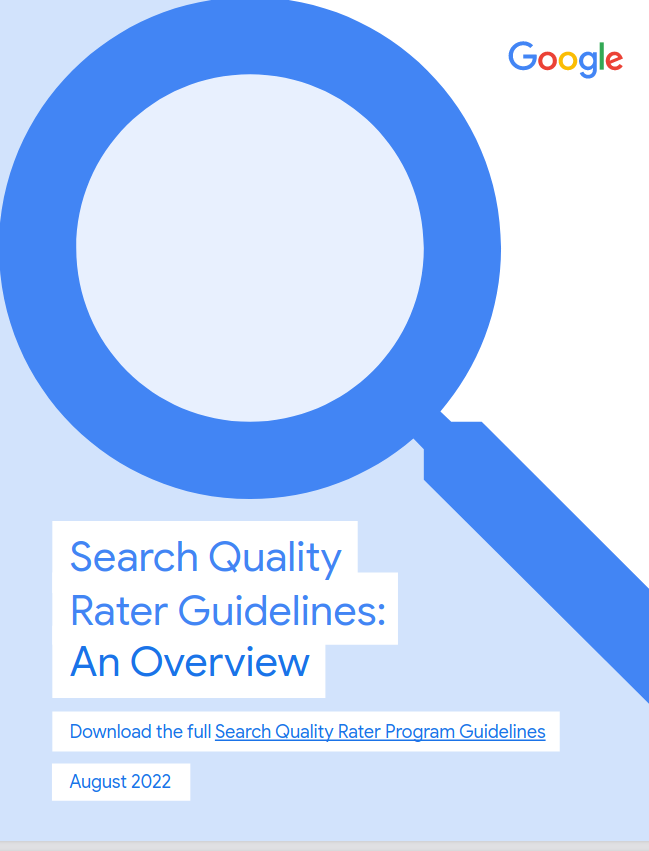

# Content strategy and editorial quality
# Preface
	
## Github repository

[heinzwittenbrink/slides-editorial-processes](https://github.com/heinzwittenbrink/slides-editorial-processes "heinzwittenbrink/slides-editorial-processes")

## Goals and plan of the course

##

1. Know what editing, editorial processes and an editorial team is
2. Be able to do consulting for an organisation about the forming and management of an editorial team
3. Know important factors and influences for the future development of editorial teams

::: notes

Das Ziel ist, dass wir als Gruppe lernen.

:::

##

4. Handle editorial roles and processes in your master thesis

<https://docs.google.com/document/d/1XwUh174CTKIW3BbSBIXidmunb1aXa5ounsAv-2nowqE/edit#heading=h.gjdgxs>

::: notes

We all know these processes, and we all have experience with editorial processes that are not optimal. Conversely, good quality is also related to well-established editorial processes. We also want to gather a lot of our experience, with the questions:

Which factors outside the editorial office play a relevant role?
Where alternatives are possible?

::: 

## Goals today

Understanding the basics of *the craft of editing* 

- Content strategy and editorial praxis
- What is editorial quality?
- Editorial quality and search

## Second and third part

- Reviewing the editorial process of contentstrategy.at
- Filling the editorial roles of contentstrategy.at
- Perspective: Ethical and social aspects of editing

## Timetable for today

11:00 - 11:15: Introduction

11:15 – 11:45 Editing as a root of content strategy

11:45 - 13:00: Editing and Roles in contentstrategy.at

11:45 – 12:00: Goals

12:00 – 12:30: Review of the workflow

12:30 – 13:00: Team building, definition of communication channels

13:00 – 14:00: Lunch break

---
14:00: Input and tasks: Editorial Quality and CS

15:30: Break

16:00 – 18:00: Editing for the net, A.I. and the epistemic crisis

## Teams contenstrategy.at

- Commissioning editors
- Writers/editors
- Final Editors and managing editors
- Development
- Social media

::: notes

Aktuelles Dokument: <https://docs.google.com/spreadsheets/d/1mznixzT9apFwHdvNdVuz45vUXeRcZBBqpzCWuty85W8/edit?usp=sharing>

Editorial checklist: <https://docs.google.com/document/d/1inTQYltJnPZfDpDdYoSZEvyKDkhU_bkbEDGVZ_GP-W8/edit?usp=sharing>

Lecture reports are always about one of the logical parts of a course. 

It is important to work as a team and to be aware of the work of the other parts of the team.

Key words for the work of the commissioning editors are *overview* and *subject matter expertise*. 

:::

## Context

- Editing of articles for contentstrategy.at
- Documenting a part of this course for contenstrategy.at
- Work done by COS21
- Protocol?

## Possible Lecture Reports

Lecture 1: What is editorial quality?
Lecture 2: Types of editorial organisation
Lecture 3: Editorial roles and workflow

## Possible literature review

# Web editing as a root of content strategy

## Editing as a component of content strategy

> As their content specialists, the more we know about solid editorial practices, the better we can help our clients with the transition to the new world of distributed online publishing. 

@kissaneElementsContentStrategy2011 p. 21

## Editing as a root of content strategy

> Editorial work is so closely related to content strategy that questions about the difference between the two often arise. From the outside, content strategy can look quite a lot like the sort of editing found in magazines and newspapers. The editorial world, and that of publishing in general, has a lot to offer us. 

@kissaneElementsContentStrategy2011 p.16

## The importance of editing

- Editors as delegates of the audience
- Editors as garants of quality
- Editors as packagers of information

## Roles of the content strategist and the editor in chief

> They also need someone to decide how best to communicate it, who should make it, and so on—a sort of combination editor-in-chief and air traffic controller. They need a content strategist. 

@kissaneElementsContentStrategy2011 p.1

## Content strategists as managing editors

> Those who do content strategy work from within organizations tend to fill roles quite similar to those of a traditional managing editor: they plan and oversee the communication of new themes and ideas, manage schedules, and collaborate with writers and other content producers. 

@kissaneElementsContentStrategy2011 p.69

## Examples

[Content strategist at the city of Leoben](https://www.fresh-content.at/content-strategie-im-oeffentlichen-bereich/ "Fresh Content Content Strategie im öffentlichen Bereich")

[Content Strategists: What Do They Do, Anyway? | Intergrowth™](https://inter-growth.co/content-marketing/content-strategist/ "Content Strategists: What Do They Do, Anyway? | Intergrowth™")

## Content strategies have to be translated into editorial decisions

- Dependencies of content strategies and contentent strategists from editors
- Content strategy is about channels, not items
- Content channels can only be managed by editors

## Why editorial is important

> In my experience, it is very easy for brilliant information architects (or UX people who do information architecture) to underestimate the importance of editorial planning, voice and tone, and detailed guidelines for content creation @kissaneElementsContentStrategy2011 p. 59

## Editors cannot be replaced by specialists

> If you rely on internal experts without a dedicated editor and approval process, you’re courting trouble. @kissaneElementsContentStrategy2011 p. 66

## Editing as necessary skill and craft

> But the truth is, none of these tools can replace a skilled in-house editor. If your client will be creating and managing more than a few dozen pages of content, they’ll need an editor or internal content strategist to keep things running smoothly. @kissaneElementsContentStrategy2011 p. 69

## Editing is about authority and leadership

> Content creation encompasses writing, illustration, information visualization, metadata and text-equivalent production, and interface writing, and is supported by creative direction and old-fashioned editorial leadership. @kissaneElementsContentStrategy2011 p. 62

## Editing as continuous handling of complex situations with unexpected components

> The essence of editorial work lies not in style guides and arguments about grammar, but in the ability to cultivate relationships, manage chaos, and serve readers. It’s not a profession to be learned from books, but these three very different takes will help. Kissane p. 78

## Real world editing

> But real-world editing is much more about crack organizational skills, a habit of developing practical communication ideas, and the ability to deal firmly and diplomatically with the whole crew of people involved in getting a book, newspaper, or website from concept to delivery. Kissane p. 17

## Tasks of editors and editorial teams

* maintaining consistency (often with style guides)
* correct language
* passion for getting the story
* development of themes and narrative arcs
* reactions to outside events
* managing writers and creators
* maintaining balanced variety

## Editors as advocates of the readers

> Editors worth their salt work not for writers or publishers, but for readers. Kissane (2011) p. 17

> Paradoxically, it’s only by working tirelessly for our readers that we can genuinely serve our clients and employers Kissane Kissane (2011) p. 18

> Acting as a user advocate doesn’t make you an impractical idealist. As we’ve learned from our editorial colleagues, if your content doesn’t work for the user, you’ve already failed. User advocacy is simply a way of ensuring that a project achieves business goals. •	 @kissaneElementsContentStrategy2011 p. 47

## Storytelling as a focus for editors

> Whatever corner of the publishing world they come from, editors know how to help other people tell the best, most engaging stories they can tell. Content people with backgrounds in journalism or publishing usually have the basics of storytelling down cold, but the rest of us can learn from the storytelling principles of these fields—from the basics like building a lead that hooks the reader (and supporting it with facts and quotations) to sophisticated techniques for layering in secondary narratives. @kissaneElementsContentStrategy2011 p. 18

## Discussion: Editing for print and digital

## Content and packaging

> Some lines of fair play can be drawn, but lightly. A manuscript's *content* … is the author's province … But the *form* of the final product–its organization, pace. packaging–is what editors like to think is their speciality. 

## Literature

- The elements of content strategy
- The elements of editing
- Google search central on editorial quality 

## Kissane

{width=50%}

[The Elements of Content Strategy — A Book Apart](https://elements-of-content-strategy.abookapart.com/ "The Elements of Content Strategy — A Book Apart")

## About Erin Kissane

[Erin Kissane's small internet website](https://erinkissane.com/ "Erin Kissane's small internet website")

##  Plotnik

{width=30%}

[The Elements of Editing: A Modern Guide... book by Arthur Plotnik](https://www.thriftbooks.com/w/the-elements-of-editing-a-modern-guide-for-editors-and-journalists_arthur-plotnik/510695/#edition=2021774&idiq=24815365 "The Elements of Editing: A Modern Guide... book by Arthur Plotnik")
[@plotnikElementsEditing1982]

## Plotnik online

<iframe src="https://archive.org/embed/elementsofeditin00plot" width="560" height="384" frameborder="0" webkitallowfullscreen="true" mozallowfullscreen="true" allowfullscreen></iframe>

[The elements of editing : Internet Archive](https://archive.org/details/elementsofeditin00plot/page/40/mode/2up "The elements of editing : a modern guide for editors and journalists : Plotnik, Arthur : Free Download, Borrow, and Streaming : Internet Archive")

## Google

{width=30%}

[Creating Helpful, Reliable, People-First Content | Google Search Central](https://developers.google.com/search/docs/fundamentals/creating-helpful-content)
[@googlesearchcentralCreatingHelpfulReliable]

## Question to the group: Further sources?

# Editorial Quality

## Google: Quality and SEO

[Creating Helpful, Reliable, People-First Content | Google Search Central  |  Documentation  |  Google Developers](https://developers.google.com/search/docs/fundamentals/creating-helpful-content "Creating Helpful, Reliable, People-First Content | Google Search Central  |  Documentation  |  Google Developers") 
[@googlesearchcentralCreatingHelpfulReliable]

## {data-background-image="pics/plotnik-content-criteria.png"}

## Content criteria

- Imformation
- Analysis and interpretation
- Balance
- Originality

## Readability criteria

- Appeal
- Concreteness and clarity
- Color and tone

## Impact criteria

- Enlightenment
- Force
- Relevance

## Exercise 1 (groupwise)

<!--

[Urgent need for regulatory intervention to turn the tide on misleading corporate climate pledges | NewClimate Institute](https://newclimate.org/news/urgent-need-for-regulatory-intervention-to-turn-the-tide-on-misleading-corporate-climate "Urgent need for regulatory intervention to turn the tide on misleading corporate climate pledges | NewClimate Institute")

::: notes

This a new article about a burning topic: a UN initiative to ban corporate greenwashing. The article states that a first guidline document published yesterday is totally insufficient. This is probaby understandable for an initiated audience, but certainly not for a normal reader of a quality newspaper website. 

:::

-->

Please analyse the first paragraphs of one of the unpublished articles of contentstrategy.at based on Plotnik's and Google's criteria. Present the results to the whole group.

## {data-background-image="pics/plotnik-line-editing-1.png"}

## {data-background-image="pics/plotnik-line-editing-2.png"}

## Line editing 1

Sentence by sentence, line by line:

- carry the author's meaning?
- are my revision's more effective?
- effectiveness of every phrase (grammar)

## Line editing 2

- numerical/factual/judgmental error
- typos
- details of footnotes etc.
- quotes, links, attributions

## Line editing 3

- step back, whole and part
- sexism, racism, ageism, ethnocentrism, 
- structure: title, subtitle, lead
- cleared additions with th author

## Exercise 2 (groupwise)

Start with line editing one of the unpublished articles in content strategy at!
Present the results to the whole group.

## Summary and questions

- What did we learn for our practice?
- What should we learn for our practice?
- Where do we need a revision of our editorial guidelines?

## References
