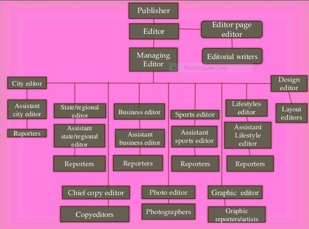

---
references:
- id: blobaumRedaktionsorganisationJournalistikon
  accessed:
    - year: 2021
      month: 11
      day: 10
  author:
    - family: Blöbaum
      given: Bernd
  title: Redaktionsorganisation | Journalistikon
  type: post-weblog
  URL: https://journalistikon.de/category/redaktionsorganisation/

- id: caseyContentStrategyToolkit2015
  abstract: >-
    In this essential guide, Meghan Casey outlines a step-by-step approach for
    doing content strategy, from planning and creating your content to
    delivering and managing it. Armed with this book, you can confidently tackle
    difficult activities like telling your boss or client what’s wrong with
    their content, getting the budget to do content work, and aligning
    stakeholders on a common vision. Reading The Content Strategy Toolkit is
    like having your own personal consulting firm on retainer with a complete
    array of tools and tips for every challenge you’ll face. In this practical
    and relevant guide, you’ll learn how to: Identify problems with your content
    and persuade your bosses it’s worth the time and resources to do it right
    Make sense of your business environment and understand your audience Get
    stakeholders aligned on business goals and user needs Set your content
    strategy and decide how to measure success Create, maintain, and govern
    on-strategy content You’ll learn to control your content–and not have it
    control you.
  author:
    - family: Casey
      given: Meghan
  edition: 1st edition
  event-place: San Francisco, California
  ISBN: 978-0-13-410510-9
  issued:
    - year: 2015
      month: 6
      day: 15
  language: English
  number-of-pages: '288'
  publisher: New Riders
  publisher-place: San Francisco, California
  title: >-
    The Content Strategy Toolkit: Methods, Guidelines, and Templates for Getting
    Content Right
  title-short: The Content Strategy Toolkit
  type: book

- id: kissaneElementsContentStrategy2011
  abstract: Literaturverz. und Linksammlung S. 76 - 79
  author:
    - family: Kissane
      given: Erin
  call-number: ST 252 K618
  collection-title: Brief books for people who make websites
  event-place: New York, NY
  ISBN: 978-0-9844425-5-3
  issued:
    - year: 2011
  language: eng
  number-of-pages: '81'
  publisher: A Book Apart
  publisher-place: New York, NY
  source: search-fhj.obvsg.at
  title: The elements of content strategy
  type: book

- id: kuhrtRedaktionsforschungTheorieUnd2002
  abstract: >-
    Redaktionsforschung - Theorie und Praxis einer Übung im Grundstudium -
    Medien - Hausarbeit 2002 - ebook 0,- € - GRIN
  accessed:
    - year: 2021
      month: 11
      day: 10
  author:
    - family: Kuhrt
      given: Henriette
  issued:
    - year: 2002
  language: de
  source: www.grin.com
  title: Redaktionsforschung - Theorie und Praxis einer Übung im Grundstudium
  type: article
  URL: https://www.grin.com/document/107147

- id: schutzenederNeujustierungJournalistikJournalismusforschung2020
  abstract: >-
    Relevanz und Fülle der Journalismusforschung sind in den letzten Jahren
    international enorm gestiegen. Dies hat einerseits mit dem Wandel durch die
    Digitalisierung von Medien und Gesellschaft zu tun – und andererseits mit
    der damit verbundenen Transformation und dem Bedeutungszuwachs ihres
    Forschungsgegenstands. Die Journalismusforschung hat sich aus dem Korsett
    „Kommunikatorforschung“ befreit, das ihr die allgemeine
    Kommunikationswissenschaft einst zugeschrieben hat: Mit neuem
    Selbstbewusstsein rückt sie einen ganzheitlichen Ansatz zur Erforschung und
    Analyse des Journalismus in der Gesellschaft in den Mittelpunkt. Sie
    entwickelt Theorien und Methoden weiter – und überdenkt ihr Verhältnis zum
    Journalismus. Diese Entwicklungen werfen einen neuen Bedarf an
    Selbstreflexion auf. Genau das hat die Fachgruppe
    Journalistik/Journalismusforschung der DGPuK auf ihrer Jahrestagung im
    September 2019 in Eichstätt getan. Unter dem Titel „Neujustierung der
    Journalistik/Journalismusforschung in der digitalen Gesellschaft“ gab die
    Eichstätter Tagung auch den Anstoß, ein Selbstverständnispapier zu
    entwickeln. Dieser Beitrag diskutiert den größeren Kontext der Tagung und
    führt in die Proceedings ein, in denen zentrale Tagungsbeiträge
    veröffentlicht sind.
  accessed:
    - year: 2021
      month: 11
      day: 10
  author:
    - family: Schützeneder
      given: Jonas
    - family: Meier
      given: Klaus
    - family: Springer
      given: Nina
  DOI: 10.21241/SSOAR.70811
  issued:
    - year: 2020
  language: de
  publisher: SSOAR -   GESIS Leibniz Institute for the Social Sciences
  source: DOI.org (Datacite)
  title: >-
    Neujustierung der Journalistik/Journalismusforschung in der digitalen
    Gesellschaft: Proceedings zur Jahrestagung der Fachgruppe
    Journalistik/Journalismusforschung der Deutschen Gesellschaft für
    Publizistik- und Kommunikationswissenschaft 2019, Eichstätt
  title-short: >-
    Neujustierung der Journalistik/Journalismusforschung in der digitalen
    Gesellschaft
  type: article-journal
  URL: https://www.ssoar.info/ssoar/handle/document/70811
  version: 1.0.0

- id: welchmanManagingChaosDigital2015
  abstract: >-
    Few organizations realize a return on their digital investment. They’re
    distracted by political infighting and technology-first solutions. To reach
    the next level, organizations must realign their assets—people, content, and
    technology—by practicing the discipline of digital governance. Managing
    Chaos inspires new and necessary conversations about digital governance and
    its transformative power to support creativity, real collaboration, digital
    quality, and online growth.
  accessed:
    - year: 2019
      month: 8
      day: 24
  author:
    - family: Welchman
      given: Lisa
  event-place: Brooklyn, NY
  issued:
    - year: 2015
      month: 2
      day: 15
  number-of-pages: '248'
  publisher: Rosenfeld Media
  publisher-place: Brooklyn, NY
  title: 'Managing Chaos: Digital Governance by Design'
  type: book
  URL: >-
    https://www.amazon.com/Managing-Chaos-Digital-Governance-Design-ebook/dp/B00TQ8DNHY/ref=sr_1_1?keywords=managing+chaos+welchman&qid=1566688179&s=books&sr=1-1

csl: apa.csl

link-citations: true

title: Editorial Organisation – Roles and Power
author: Heinz Wittenbrink

---

# Editing, authority and power

# Team structure and content

- Size and structure of the editorial team have a direct impact on the content
- The editorial team decides what is and what is not discussed.
- It thus determines how the world is presented to the recipients and also to the organization
- The power relations in the editorial office and the power over the reaction are very relevant for the content

# Special forms of editorial organisation

# Wikipedia/Community

# Newspaper Old Style

aus: @journogyanStructureFunctionsVarious2017 

# Newsroom

# Corporate Newsroom

{width=70%}

# Science

{width=70%}

# Research about editorial teams in journalism
- "Redaktionsforschung"
- tradition in the "German" tradition of research on journalism
- focus on changes induced by commercialization and digitization
- translated into the organization of journalitic teams, especially news rooms

# Basic text for research of editorial teams

- [„Die Zeitungsredaktion als organisiertes soziales System“](http://transfer.dgpuk.de/abstracts/die-zeitungsredaktion-als-organisiertes-soziales-system-ergebnisse-einer-redaktionsbeobachtung/ "„Die Zeitungsredaktion als organisiertes soziales System“ – Ergebnisse einer Redaktionsbeobachtung – transfer")
 - [Manfred Rühl - Wikipedia](https://en.wikipedia.org/wiki/Manfred_R%C3%BChl "Manfred Rühl - Wikipedia")

{width=30%}

#

> This social "system of editing" designed by Rühl assumes that the performance of this system consists in reducing the complexity of the environment in order to ensure its own continued existence. In doing so, he draws on the theory of Niklas Luhmann

@kuhrtRedaktionsforschungTheorieUnd2002

#

> By constructing the so-called "member role," Luhmann enables the researcher to examine, for example, the organizational component "power" for the gap between formal authority and actual power.

@kuhrtRedaktionsforschungTheorieUnd2002

#

> This is "a set of specific expectations, separate and distinct from all others". Recognition of this membership role is mandatory if membership is to be maintained.

@kuhrtRedaktionsforschungTheorieUnd2002

#

> ... the editor accepts his or her role upon joining the editorial team and commits to the purpose within the editorial team

@kuhrtRedaktionsforschungTheorieUnd2002

#

> At the same time, they also relieve the editor of personal responsibility, a fact that makes editorial action possible in the first place, says Rühl in a summary.

@kuhrtRedaktionsforschungTheorieUnd2002

#

> In addition to the member role, the editor simultaneously fills his work role, which is, however, closely related to the first role

@kuhrtRedaktionsforschungTheorieUnd2002

#

> Another integration mechanism are the "intermediary systems". The editorial conference, for example, is such a system, as is the picture conference, and so on. Editors are interwoven into them in their work role as well as in their member role.

@kuhrtRedaktionsforschungTheorieUnd2002

# Research about coordination

One-to-one conversation as the most frequent form of coordination within editorial teams

# Defined requirements and need for editorial coordination

The number of coordinating actions increases, when rules and guidelines decrease

# Coordination is required

Journalistic practice is not possible without coordination. Usually coordination is not institutionalized except staff conferences (Redaktionskonferenzen)

# Editorial programs and decision making

1. Classification by rubrics/ressorts/departments
2. Presentation of information
3. Generation and collection of information (sourcing, reporting etc.)
4. Selection of information by routines for decision and actions
5. Fact checking/verification

@kuhrtRedaktionsforschungTheorieUnd2002

#

> Another structure-forming process within the editorial office is the "decision-making action" which can be analytically divided into three phases: the collection, the selection and the condensation of information.

@kuhrtRedaktionsforschungTheorieUnd2002

#

> i.e. since it is never possible to obtain all the information on a subject, each editorial team must establish criteria according to which this information, incomplete in nature, can be evaluated as useful

@kuhrtRedaktionsforschungTheorieUnd2002

#

> This means that when certain causes or events occur, the editorial team reacts according to the premises it has previously set for them. Each subsystem thereby develops its own conditional program.

@kuhrtRedaktionsforschungTheorieUnd2002

#

> The purpose program, on the other hand, is oriented to the effect that the information processed by the editorial staff has on the environment

@kuhrtRedaktionsforschungTheorieUnd2002

#

> Rühl cites the editorial deadlines as an internal editorial purpose program, while the orientation to the "common good" serves as an external editorial purpose program.

@kuhrtRedaktionsforschungTheorieUnd2002

#

> In this context, the authority of the role holders is composed of personal influence, which is tied to the person of the editor, and authority, which is formalized by the editorial office and limited to each member of the editorial staff.

@kuhrtRedaktionsforschungTheorieUnd2002 

#

> Conflicts in the newsroom are guided by the formal membership rules, are played out within the newsroom, and are subject to the controls of the formal authority in the system, which, however, has the function of unifying the system at the same time.

@kuhrtRedaktionsforschungTheorieUnd2002

#

> Editorial structure leads to fighting for influence in the system, not against it

@kuhrtRedaktionsforschungTheorieUnd2002

#  

Constructivist approach (Stefan Weber)

> The "topic recursivity" hypothesis states that journalistic topics are increasingly generated from journalistic sources. At the same time, citations are also increasingly used as references from journalistic sources.

#

> In his study on "Editorial Offices as Coordination Centers," Altmeppen examines the so-called "organizational-dispositive" activities of journalists, i.e., the coordination of journalistic work

@kuhrtRedaktionsforschungTheorieUnd2002 

# Digression: Editing and intertextuality

- Editing is always about the relationship between texts
- Editorial quality depends on transparency
- Editorial quality depends on an appropriate translation

---

- Subject matter experts are responsible for correct translations
- Editors are reponsible for the appropriateness
- Editorial guidelines define the translation rules

# Finegrained structures get out of use

> Altmeppen notes that at the level of organizational programs, differentiated structures are being replaced by roughly structured ones. This makes journalists' work more flexible; they can no longer rely on assignments to fixed departments and roles.

#

> Examples of the manifold aspects of change are the orientation of editorial structures and strategies to digital forms of publication

@schutzenederNeujustierungJournalistikJournalismusforschung2020

#

> Juliane Lischka addresses an essential dilemma of editorial offerings in the digital context: The difficult compatibility of professional standards with economic goals.

@schutzenederNeujustierungJournalistikJournalismusforschung2020

#

> However, the editorial units are still tied to media companies or media houses.

@schutzenederNeujustierungJournalistikJournalismusforschung2020

# ROI as limiting factor for editorial quality and credibility

- Example: private radio and tv station
- Conflicts between journalistic ambition and content marketing

# Research topics/points for discussion

- Editorial teams in commercial organizations
- Editorial teams in non profit organizations
- Content strategy as an alternative to traditional forms of describing the "programs" of editorial teams and news rooms

# Exercise 2

- Please work in groups (the same as for exercise 1)
- Name a person to collect and report the results
- Describe the editorial team you are working in or one you know
- Focus on roles, authority and decision finding, work force, allocation of resources
- Name problems and learnings
- Condense your insights and present them in the whole group

-

