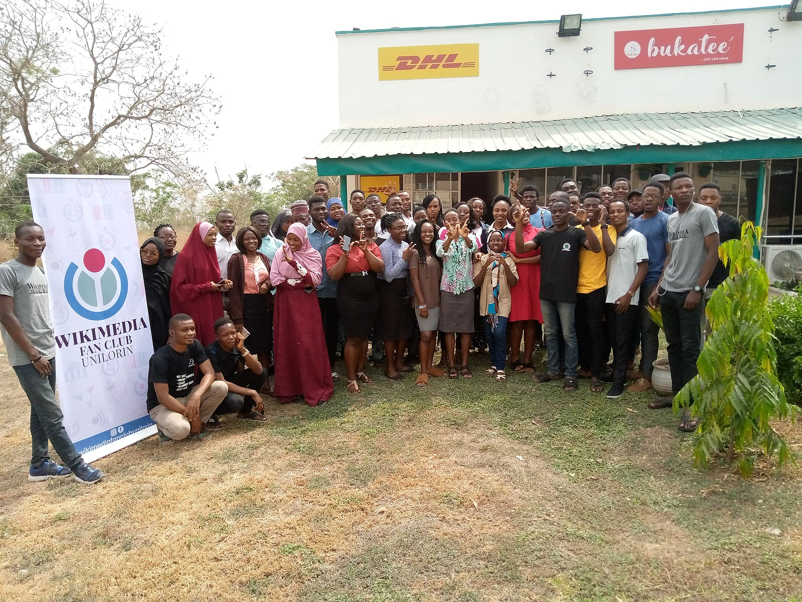

# Editing, authority and power

# Team structure and content

- Size and structure of the editorial team have a direct impact on the content
- The editorial team decides what is and what is not discussed.
- It thus determines how the world is presented to the recipients and also to the organization
- The power relations in the editorial office and the power over the reaction are very relevant for the content

::: notes

We have seen that classic editorial work is one of the roots of content strategy. Today we want to look at how this editorial work can be analysed from a social science perspective and what we can learn from it for content strategy. In doing so, I am deliberately drawing on the study of traditional editorial offices. The transfer service or necessity for us consists above all in considering what is different in the editorial structures we know, why these differences exist, and whether we can perhaps nevertheless learn something for our work from these old studies on journalistic practices. 

The focus here is again on quality and selection, i.e. how decisions are made about what is published and when. These decisions are very closely linked to the power structures in an editorial office and also in the organisation to which the editorial office belongs. As content strategists, we are always the advocates of the users who are interested or should be interested in the content. That's why there are always conflicts with the power structures in organisations in our work.

:::

# Example for the relevance of power in editorial teams:

[Inside Fridays for Future International: This is how Israel haters are hijacking the climate movement | Jewish General](https://www-juedische--allgemeine-de.translate.goog/allgemein/inside-fridays-for-future-international-so-kapern-israelhasser-die-klimabewegung/?_x_tr_sl=de&_x_tr_tl=en&_x_tr_hl=de&_x_tr_pto=wapp "Inside Fridays for Future International: This is how Israel haters are hijacking the climate movement | Jewish General")

# Special forms of editorial organisation

# Wikipedia/Community

# Wikipedia – Editing with a consensus based ethos

#

[Wikipedia:Editorial oversight and control - Wikipedia](https://en.wikipedia.org/wiki/Wikipedia:Editorial_oversight_and_control "Wikipedia:Editorial oversight and control - Wikipedia")

# Newspaper Old Style

aus: @journogyanStructureFunctionsVarious2017 

# Example: Job description for an Editor-in-Chief

[Editor-in-Chief: Everything You Need To Know About the Role | Indeed.com](https://www.indeed.com/career-advice/finding-a-job/editor-in-chief "Editor-in-Chief: Everything You Need To Know About the Role | Indeed.com")

# Newsroom

# Example

<iframe width="560" height="315" src="https://www.youtube.com/embed/PNGZAWiKflo?si=5NnFDmkKNIfsRijA" title="YouTube video player" frameborder="0" allow="accelerometer; autoplay; clipboard-write; encrypted-media; gyroscope; picture-in-picture; web-share" allowfullscreen></iframe>

<https://youtu.be/PNGZAWiKflo?si=Hv56evDBZX4-evVY>

# Corporate Newsroom

{width=70%}

# Example

<iframe width="560" height="315" src="https://www.youtube.com/embed/2M2ysmdhXkI?si=UPZKgGmHUFoylaT4" title="YouTube video player" frameborder="0" allow="accelerometer; autoplay; clipboard-write; encrypted-media; gyroscope; picture-in-picture; web-share" allowfullscreen></iframe>

<https://youtu.be/2M2ysmdhXkI?si=oMtiOHeUAPlOXtBH>

# Science

{width=70%}

[Wie die IPCC-Berichte erstellt werden - de-IPCC](https://www.de-ipcc.de/226.php "Wie die IPCC-Berichte erstellt werden - de-IPCC")

# IPCC Author Experience

<iframe width="560" height="315" src="https://www.youtube.com/watch?v=cTaFy7Sgu-I" title="YouTube video player" frameborder="0" allow="accelerometer; autoplay; clipboard-write; encrypted-media; gyroscope; picture-in-picture; web-share" allowfullscreen></iframe>

<https://www.youtube.com/watch?v=cTaFy7Sgu-I>

# Content Teams

[@hicksContentTeamStructure2025]

# Roles

- Content strategists
- Content creators and content writers
- Content editors and quality assurance team members
- SEO specialists
- Visual content creators

---

- Content managers and project coordination roles
- Social media specialists and social media management positions

# Centralized Content Team Model

# Decentralized Content Team Model

# Hybrid Content Team Model

---

- Agency style content team models
- Cross-functional content team integration strategies

# Small Business Content Team Structure (1-4 Members)

# Mid-Size Company Content Team Structure (5-10 Members)

# Enterprise Content Team Structure (11+ People)

# Research about editorial teams in journalism
- "Redaktionsforschung" (Research on editorial teams)
- tradition in the "German" vein of research on journalism
- [ ] - focus on changes induced by commercialization and digitization
- translated into the organization of journalistic teams, especially news rooms

# Basic text for research on editorial teams

- [„Die Zeitungsredaktion als organisiertes soziales System“](http://transfer.dgpuk.de/abstracts/die-zeitungsredaktion-als-organisiertes-soziales-system-ergebnisse-einer-redaktionsbeobachtung/ "„Die Zeitungsredaktion als organisiertes soziales System“ – Ergebnisse einer Redaktionsbeobachtung – transfer") [@ruhlZeitungsredaktionAlsOrganisiertes1979]
 - [Manfred Rühl - Wikipedia](https://en.wikipedia.org/wiki/Manfred_R%C3%BChl "Manfred Rühl - Wikipedia")

{width=30%}

#

> This social "system of editing" designed by Rühl assumes that the performance of this system consists in reducing the complexity of the environment in order to ensure its own continued existence. In doing so, he draws on the theory of Niklas Luhmann

[@kuhrtRedaktionsforschungTheorieUnd2002]

#

> By constructing the so-called "member role," Luhmann enables the researcher to examine, for example, the organizational component "power" for the gap between formal authority and actual power.

@kuhrtRedaktionsforschungTheorieUnd2002

#

> This is "a set of specific expectations, separate and distinct from all others". Recognition of this membership role is mandatory if membership is to be maintained.

@kuhrtRedaktionsforschungTheorieUnd2002

#

> ... the editor accepts his or her role upon joining the editorial team and commits to the purpose within the editorial team

@kuhrtRedaktionsforschungTheorieUnd2002

#

> At the same time, they also relieve the editor of personal responsibility, a fact that makes editorial action possible in the first place, says Rühl in a summary.

@kuhrtRedaktionsforschungTheorieUnd2002

#

> In addition to the member role, the editor simultaneously fills his work role, which is, however, closely related to the first role

@kuhrtRedaktionsforschungTheorieUnd2002

#

> Another integration mechanism are the "intermediary systems". The editorial conference, for example, is such a system, as is the picture conference, and so on. Editors are interwoven into them in their work role as well as in their member role.

@kuhrtRedaktionsforschungTheorieUnd2002

# Research about coordination

One-to-one conversation as the most frequent form of coordination within editorial teams

# Defined requirements and need for editorial coordination

The number of coordinating actions increases, when rules and guidelines decrease

# Coordination is required

Journalistic practice is not possible without coordination. Usually coordination is not institutionalized except staff conferences (Redaktionskonferenzen)

# Editorial programs and decision making

1. Classification by rubrics/ressorts/departments
2. Presentation of information
3. Generation and collection of information (sourcing, reporting etc.)
4. Selection of information by routines for decision and actions
5. Fact checking/verification

@kuhrtRedaktionsforschungTheorieUnd2002

#

> Another structure-forming process within the editorial office is the "decision-making action" which can be analytically divided into three phases: the collection, the selection and the condensation of information.

@kuhrtRedaktionsforschungTheorieUnd2002

#

> i.e. since it is never possible to obtain all the information on a subject, each editorial team must establish criteria according to which this information, incomplete in nature, can be evaluated as useful

@kuhrtRedaktionsforschungTheorieUnd2002

#

> This means that when certain causes or events occur, the editorial team reacts according to the premises it has previously set for them. Each subsystem thereby develops its own conditional program.

@kuhrtRedaktionsforschungTheorieUnd2002

#

> The purpose program, on the other hand, is oriented to the effect that the information processed by the editorial staff has on the environment

@kuhrtRedaktionsforschungTheorieUnd2002

#

> Rühl cites the editorial deadlines as an internal editorial purpose program, while the orientation to the "common good" serves as an external editorial purpose program.

@kuhrtRedaktionsforschungTheorieUnd2002

#

> In this context, the authority of the role holders is composed of personal influence, which is tied to the person of the editor, and authority, which is formalized by the editorial office and limited to each member of the editorial staff.

@kuhrtRedaktionsforschungTheorieUnd2002 

#

> Conflicts in the newsroom are guided by the formal membership rules, are played out within the newsroom, and are subject to the controls of the formal authority in the system, which, however, has the function of unifying the system at the same time.

@kuhrtRedaktionsforschungTheorieUnd2002

#

> Editorial structure leads to fighting for influence in the system, not against it

@kuhrtRedaktionsforschungTheorieUnd2002

#

Constructivist approach (Stefan Weber)

> The "topic recursivity" hypothesis states that journalistic topics are increasingly generated from journalistic sources. At the same time, citations are also increasingly used as references from journalistic sources.

#

> In his study on "Editorial Offices as Coordination Centers," Altmeppen examines the so-called "organizational-dispositive" activities of journalists, i.e., the coordination of journalistic work

@kuhrtRedaktionsforschungTheorieUnd2002 

# Digression: Editing and intertextuality

- Editing is always about the relationship between texts
- Editorial quality depends on transparency
- Editorial quality depends on an appropriate translation

---

- Subject matter experts are responsible for correct translations
- Editors are reponsible for the appropriateness
- Editorial guidelines define the translation rules

# Finegrained structures get out of use

> Altmeppen notes that at the level of organizational programs, differentiated structures are being replaced by roughly structured ones. This makes journalists' work more flexible; they can no longer rely on assignments to fixed departments and roles.

#

> Examples of the manifold aspects of change are the orientation of editorial structures and strategies to digital forms of publication

@schuetzenederNeujustierungJournalistikJournalismusforschung2020

#

> Juliane Lischka addresses an essential dilemma of editorial offerings in the digital context: The difficult compatibility of professional standards with economic goals.

@schuetzenederNeujustierungJournalistikJournalismusforschung2020

#

> However, the editorial units are still tied to media companies or media houses.

@schuetzenederNeujustierungJournalistikJournalismusforschung2020

# ROI as limiting factor for editorial quality and credibility

- Example: private radio and tv station
- Conflicts between journalistic ambition and content marketing

# Research topics/points for discussion

- Editorial teams in commercial organizations
- Editorial teams in non profit organizations
- Content strategy as an alternative to traditional forms of describing the "programs" of editorial teams and news rooms

# Exercise 

- Please work in groups for about 20 minutes
- Name a person per group to collect and report the results
- Describe the different editiorial roles in contentstrategy.at and possible improvements
- What is the contribution of each role to the quality of the product?

---

- Which roles are missing?
- Where does/should communication about editorial quality take place?
- How ist authority handled and how should it be handled?
- Is there something like a member role (Luhmann, see presentation)? What is it releationship to the different work roles?
- Condense your insights and present them in the whole group

# References
