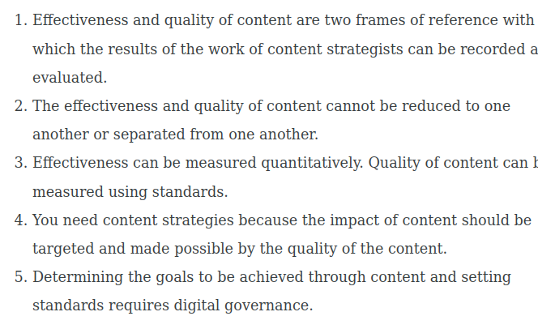

# Task

1. Please form groups as for the preceding tasks
2. Please name implicit or explicit editorial standard in an editorial team you know
3. Who defined these standards?
4. What happens if they are not met?
5. Does the relevance of editorial standards have consequences for your work as a content strategist?

Please use the input of the presentation and post the results in the channel!

# Example of a standard

 <https://docs.google.com/document/d/1inTQYltJnPZfDpDdYoSZEvyKDkhU_bkbEDGVZ_GP-W8/edit?usp=sharing> (Thx to the COS21!)

# Content Strategists as advocates of standards

<https://wittenbrink-net.translate.goog/zielsetzung-und-messung-der-arbeit-von-contentstrategen-wirksamkeit-und-qualitat/?_x_tr_sl=de&_x_tr_tl=en&_x_tr_hl=de&_x_tr_pto=wapp>

# Theses

# Thesis 1: Effectiveness vs. quality

The effectiveness and quality of content are two frames of reference that can be used to record and evaluate the results of content strategists' work.

::: notes

The starting point for these considerations are the key terms that Lucie Hyde spoke about at the Meetup *Making the Call on Content Quality: Effectiveness and Quality* during a presence week of our program 2016 in London. Hyde explained that content strategy is always focussed on both, but that effectiveness takes precedence. She also used the example of the companies she has worked for to show that effectiveness and quality are understood very differently depending on the client.

In this and other presentations, Hyde has focussed on how to measure effectiveness. She talks about the need to distinguish between impact and *health*, and that impact always depends on factors other than effectiveness, i.e. the context. By healthy content, she means content whose effectiveness does not fizzle out, i.e. which has a lasting effect in different situations. It is important that effectiveness can be measured, even if it can be difficult to determine the measurement parameters and the relevance of different factors in individual cases.

:::

# Thesis 2: Interdependence of effectiveness and quality

Effectiveness and quality of content cannot be reduced to one another and cannot be separated from one another.

::: notes

I understand this dichotomy of effectiveness and quality based on the role of standards, which we have encountered on several occasions in content strategy. I would like to continue with an idea that is also essentially present in Hyde: quality, unlike effectiveness, cannot be determined quantitatively, but can only be determined in relation to standards. Whether something is “good” can only be understood in relation to normative guidelines. The standards on which the creation of the content is based can be described as the normative specifications. We call something good when it meets a standard. Nevertheless, it is of course very difficult to determine where quality lies in detail.

What comes to mind here is the concept of [quality without a name](https://translate.google.com/website?sl=de\&tl=en\&hl=de\&client=webapp\&u=http://c2.com/cgi/wiki?QualityWithoutaName "Quality Withouta Name") that [Christopher Alexander](https://translate.google.com/website?sl=de\&tl=en\&hl=de\&client=webapp\&u=https://de.wikipedia.org/wiki/Christopher_Alexander "Christopher Alexander - Wikipedia") speaks of. One can only speak to a limited extent, if at all, about measuring or measurability of quality. (During our presence week 2016 in London, we were able to attend two presentations from companies that produce software that helps organizations comply with standards: [ActiveStandards](https://translate.google.com/website?sl=de\&tl=en\&hl=de\&client=webapp\&u=https://www.activestandards.com/ "ActiveStandards |  End-to-end solutions for digital governance") and [Acrolinx](https://translate.google.com/website?sl=de\&tl=en\&hl=de\&client=webapp\&u=http://www.acrolinx.com/ "Home |  Acrolinx") .)

:::

#

<https://de.slideshare.net/luciehyde/lucie-hyde-csa2013keynote10thingsivelearned>

#

>  MEASUREMENT IS ESSENTIAL BUT KPIs ARE NOT GOALS

> Measuring effectiveness is essential if we are to succeed
> 
> Quality is NOT the same as effectiveness. Effectiveness is more important. A robust measurement framework should include IMPACT and HEALTH measurements. Outcome-based goals are also important – but they often (usually) include more than content.

# Thesis 3: Standards vs. measurement

Effectiveness can be measured quantitatively. Content quality can be evaluated with respect to standards.

::: notes

Impact counts—content strategy from the client’s perspective

From the client’s perspective, the impact of content is the priority. Content strategists are supposed to increase the effectiveness of content. The effect of the content strategy itself is reflected, on the one hand, in the effect it has on the users of the content, for example in content marketing. On the other hand, this effect also lies in the better usability of content and more effective production (health).

The impact of the work of content strategists can be measured using metrics. On the front end, these metrics refer to measurable user reactions. The best way to capture effects in the backend is through costs.

We have heard several times - I also know this motto from [Sascha Stoltenow](https://translate.google.com/website?sl=de\&tl=en\&hl=de\&client=webapp\&u=https://twitter.com/BendlerBlogger?ref_src%3Dtwsrc%255Egoogle%257Ctwcamp%255Eserp%257Ctwgr%255Eauthor "Sascha Stoltenow (@BendlerBlogger) |  Twitter") - that it is best to avoid the expression content strategy when speaking to clients. This has to do with the impact orientation of clients. Content strategists are commissioned or hired because customers or employers hope to have an impact. Conversely, you can only sell content strategy if you justify that it has an impact. It's much easier to describe the impact of a content strategy than what you do with it.

However, content only has an impact on the user if its quality is right. The users are - this is a triviality, but it is often forgotten by the clients - not at all interested in the objectives of the clients. What is important to them is whether they can use the content and whether the content meets their needs and requirements. It is impossible to discuss whether content meets the needs of users without also talking about the quality of content. Users want content to be *good* , whatever that means. Content strategists would have to focus on this quality from the user's perspective and, if necessary, even enforce it against the clients if the effect intended by the client is actually to be achieved.

:::

# AI Support for the evaluation of content

[Home - Acrolinx](https://www.acrolinx.com/de/ "Home - Acrolinx")

Use of ChatGBT to support editiorial standards? 

# Thesis 4: Standards and content strategy

  Content strategies are needed because the impact of content should be targeted and is made possible by the quality of the content.

::: notes

If we look at the beginnings of content strategy on the web, it is precisely this importance of quality that motivates content strategy and which they use to argue in favour of their discipline. Kristina Halvorson, in particular, has always insisted that companies become publishers on the web and therefore must abide by the rules of publishing. It is clear that content has an economic impact, but it has it as content.

:::

# Thesis 5: Standards and governance

   Determining the goals to be achieved through content and setting standards require digital governance.

   <https://slideplayer.com/slide/4895698/>

::: notes

Managing the impact of an organization's content, such as determining and enforcing the standards to which that content meets, are key components of digital governance. Governance must ensure that the impact of the content is targeted and that the standards required to achieve this impact are met. [Lisa Welchman](https://translate.google.com/website?sl=de\&tl=en\&hl=de\&client=webapp\&u=http://rosenfeldmedia.com/expert/lisa-welchman/ "Lisa Welchman - Rosenfeld Media") , who worked for ActiveStandards for a long time, has worked intensively on digital governance in the content strategy community . She has [identified digital strategy, standards and policies as the main areas of responsibility for digital governance](https://translate.google.com/website?sl=de\&tl=en\&hl=de\&client=webapp\&u=http://rosenfeldmedia.com/books/managing-chaos/ "Managing Chaos - Rosenfeld Media") . I increasingly believe that her work has a key role in describing the tasks of content strategists and their place in organizations.

:::

#

   

#

<https://www.flickr.com/photos/rosenfeldmedia/15911189043/in/album-72157650408729568/>

# Relevant editorial standards

- Journalism
- Science
- Reference works
- Documentation and product standards

# Standards are shared by publishers and users

- Standards show that publishers and users share the same values
- Standards are a base for trust
- Non-compliance with a shared standard endangers confidence and trust

# Standards have always ethical implications

- Compliance with a standards shows the acceptance of more than pragmatic goals.
- Editorial standards are related to common goods.
- Standards-compliance is related to the licence to operate of commercial brands.

#

  
Licence to operate [… ] refers to the social acceptance of companies. This is based on the intersubjective perception of the members of society and therefore cannot be formally acquired. In the wake of growing criticism of companies and their value creation, the question of how to secure this licence is becoming increasingly relevant. 

<https://wirtschaftslexikon.gabler.de/definition/licence-operate-51612>

