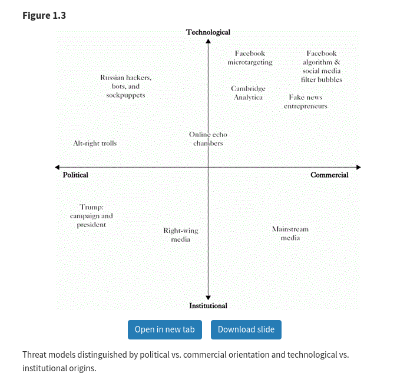
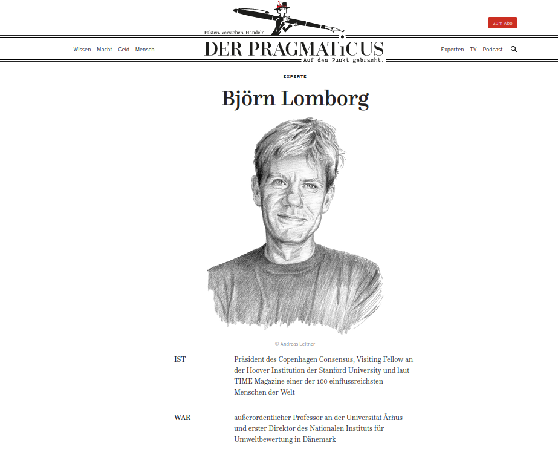
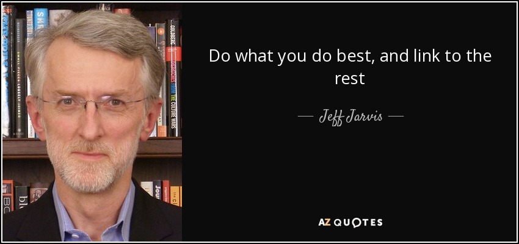

# Editing for the net and the epistemic crisis

##  

ἐπιστήμη (episteme) = science, knowledge
κρίσις (krisis) = decision, trial, quarrel, turning point

# Signals of the epistemic crisis

## {data-background="pics/google-suche-luisa-neubauer.png"}

## {data-background="pics/youtube-climate-change.png"}

::: notes

[Climate misinformation by source: John Christy](https://skepticalscience.com/skeptic_John_Christy.htm "Climate misinformation by source: John Christy")

::: 

## The relevance of the "epistemic crisis"

##

> The 2016 U.S. presidential election won by Donald Trump followed closely on the heels of the equally shocking success of the Leave campaign in Britain’s vote to exit the European Union. Both seemed to mark an epistemic crisis in contemporary democratic societies. As 2016 was drawing to a close, many in the United States and the European Union saw these events as signals that democracy itself was in crisis, [@benklerEpistemicCrisis2018]

## Epistemic crisis and network propaganda

## Media and propaganda before the age of the web

## Enforcement of propaganda by online platforms

##

## Generalisation of suspicion

# Algorithmic content production and propaganda

## The universal turing machine: Generation of sequences

> It is possible to invent a single machine which can be used to compute any computable sequence. If this machine **U** is supplied with a tape on the beginning of which is written the S.D \["standard description" of an action table\] of some computing machine **M**, then **U** will compute the same sequence as **M**.[@turingComputableNumbersApplication1936]

## 

 

Quelle: @gazalUniversalTuringMachine2022 

## {data-background="pics/chatgbt-universal-turing-machine.png"} 

##  

[Explain Universal Turing Machine](https://chat.openai.com/chat "Explain Universal Turing Machine")

## Personalised content curation

> And now imagine an AI model that is capable of generating not just one piece of propaganda, but 100,000 pieces that are tailored to maybe individual readers, and doing that all in real time, much faster than any human fact checker or opponent of propaganda can keep up with.

Kevin Roose [@barbaroDidArtificialIntelligence2022]

# Reference chains and truth

## Truth is connected to social practices

 

## 

<http://www.bruno-latour.fr/sites/default/files/downloads/53-PANDORA-TOPOFIL-pdf.pdf>

## 

> we can now define enunciation: the set of mediating acts whose presence is necessary for meaning; although absent from the statements, the trace of their necessary presence remains marked or inscribed, so that it can be induced or deduced from the movement of the statements. 

Bruno Latour [@latourPetitePhilosophieEnonciation1998] 

## Transformations and scientific propositions

## Editing as making sure of references

- Sourcing
- Fact Checking
- Double Checking
- Integrating
- Linking

## Paradox of editing for the net

- Multiplication of references
- Explicitness of mediations

## 

**Thesis:** 

The higher the number of (implicit and explicit) references from online content to online content, the more important the transparent relations to social practices.

# Strategies of propaganda

## Denounciation of persons

<blockquote class="twitter-tweet">
My pronouns are Prosecute/Fauci
&mdash; Elon Musk (@elonmusk) <a href="https://twitter.com/elonmusk/status/1601894132573605888?ref_src=twsrc%5Etfw">December 11, 2022</a></blockquote> `

## FLICC

- Fake Experts
- Logical Fallacies
- Impossible Expectations
- Cherry Picking
- Conspiracy Theories

##

 

## Fake Experts

##

<iframe width="560" height="315" src="https://www.youtube.com/embed/m6dmMDNzzqo" title="YouTube video player" frameborder="0" allow="accelerometer; autoplay; clipboard-write; encrypted-media; gyroscope; picture-in-picture" allowfullscreen></iframe>

[A closer examination of the fantastical numbers in Bjorn Lomborg’s new book - Grantham Research Institute on climate change and the environment](https://www.lse.ac.uk/granthaminstitute/news/a-closer-examination-of-the-fantastical-numbers-in-bjorn-lomborgs-new-book/ "A closer examination of the fantastical numbers in Bjorn Lomborg’s new book - Grantham Research Institute on climate change and the environment") [@wardCloserExaminationFantastical2020] 

## Logical Fallacies

[@cookItBeenHot2014]

## Impossible Expectations

> “Scientists can’t even predict the weather next week. How can they predict the climate in 100 years?”

@cookHistoryFLICCTechniques2020

## Cherry Picking

> “Global warming stopped in 1998.”

@cookHistoryFLICCTechniques2020

## Conspiracy Theories

<blockquote class="twitter-tweet">
The concept of global warming was created by and for the Chinese in order to make U.S. manufacturing non-competitive.
&mdash; Donald J. Trump (@realDonaldTrump) <a href="https://twitter.com/realDonaldTrump/status/265895292191248385?ref_src=twsrc%5Etfw">November 6, 2012</a></blockquote> 

# Counter strategies for content quality

## Limitation

## 

## Networks of persons

## Multidimensionality

## {data-background="pics/bellingcat-osint-tools.png"}

## 

<https://docs.google.com/spreadsheets/d/18rtqh8EG2q1xBo2cLNyhIDuK9jrPGwY9DI2UncoqJQ/edit#gid=930747607>

## Literature

