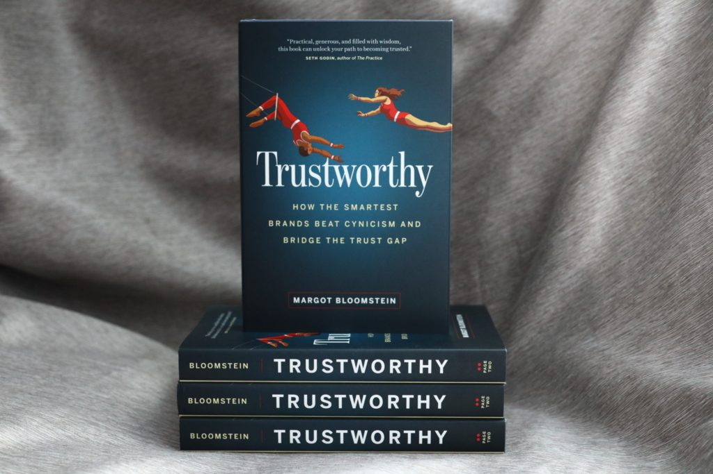

# Assuring Editorial Quality for Brands

## Three Books
## 
 
 

## 

##

#  Aspects of  Editing

##  Transforming content into usable products

- User Interestes
- Integration of production, design, legal, ...

## Assuring Quality

- Complying with standards
- Connecting content and the real world

## Example

 
 
 ##
 
 > In short, there are no breezy blurbs between these covers. More shiny cooking magazines support superficial scanning, but the editorial process at America’s Test Kitchen goes beyond superficial in a test of time, objectivity, and painstaking detail. [@bloomsteinTrustworthyHowSmartest2021, chapter 5]
 

## Staying in tune

- Defining your identity
- Developing a specific voice
- Make sure that the brand ist perceived like a person with specific properties

## Example

> "There’s a difference between Mailchimp’s voice and tone: we try to maintain a consistent voice, but we modulate our tone based on the context and customer.” 

---

> When the context is more positive, content speaks to the user’s excitement, curiosity, and relief. When the context is more negative, it’s attuned to the user’s frustration and stress. [@bloomsteinTrustworthyHowSmartest2021, chapter 2]
 
 
# Governance
 

##

## Team structure and roles

## Decision making

##
 
> Make a distinction between digital production and digital governance. Your digital governance framework is just that—a framework for decision making. It should not be applied to day-to-day production. 

## 

> For instance, just because your core digital team might be responsible for establishing editorial standards doesn’t mean that they have to approve every piece of content that goes on the site. It means that the standards author is responsible for defining the substance of the editorial standard and helping to support an environment where those standards are easy to uphold. 

---

> Don’t confuse the two. You might develop more tactical levels of governance, like content governance or taxonomy governance, but those are different, more production-focused activities than what have been described in this book.  [@welchmanManagingChaosDigital2015, Chapter: At Last: Implementing the Framework]
 
 ---
 
 > Editorial standards should be crafted by those with expertise in Web writing and content strategy. Standards related to publishing and development should be written by those who understand Web content management systems technologies _and_ how best to author content so that it can be effectively moved around and delivered by those systems.  [@welchmanManagingChaosDigital2015, Chapter: Identifying Standards Authors]
 
## Standards and accountancy
 
 Decisions are made in a framework and can be justified and improved by referring to that framework
 

 
## Implementation of standards
 
 - Documentation of all standards
 - CMS
 - Guidelines
 - Cooperation, employee training and education, continuous improvement

## Editorial role of the content strategist

- Defines digital content strategy for all digital channels.
- Acts as a consultant for projects.
- Defines digital editorial standards.
- Oversees digital content strategy.
- Manages information architecture.
- Serves as a member of the decision making team.

 [@welchmanManagingChaosDigital2015, Chapter 11]
 

  

# Style Guides

##

> A style guide helps writers understand your brand voice and content standards. It’s a living, working guide to writing for your [@fentonNicelySaidWriting2014, chapter 11]

 
## Function of style guides
 
 
Cataloguing and standardizing editorial style [@bloomsteinTrustworthyHowSmartest2021, chapter 2]

---
  
> A style guide can highlight content goals, terms to avoid, and common language mistakes. [@fentonNicelySaidWriting2014, chapter 11]

---

> Think of it like a car manual: you might not use it every day, but it’s helpful to have around when questions come up. [@fentonNicelySaidWriting2014, chapter 11]
  

 ---
  
> It’s not a workbook. Treat your style guide as a reference, not a cure-all. [@fentonNicelySaidWriting2014, chapter 11]
  

  ---

> It’s an important tool that can improve your content, but you’ll need to refine it over time. And you may need to make exceptions once in a while [@fentonNicelySaidWriting2014, chapter 11]

  
## Existing style guides as foundations

  > For most teams, it makes sense to pick an existing style guide as a foundation and build on it. [@fentonNicelySaidWriting2014, chapter 11]
  
## Make the principles explicit
  
  > Include a few overarching content principles so your team understands the spirit of your style guide. [@fentonNicelySaidWriting2014, chapter 11]

---
  
> If you have brand guidelines, design attributes, or general principles for your communications, you can use those as your content principles. [@fentonNicelySaidWriting2014, chapter 11]

---

> Dig into your company’s personality and include tips for striking the right tone. If you made a This But Not That list (...), include it as a reference.
  

  

  

## Style Guide and Content Types

  

  
> List all of the content types your company publishes. Sort them alphabetically, or try to loosely reflect the order in which people encounter them on your website [@fentonNicelySaidWriting2014, chapter 11]
  
---
  
> If you have several guidelines for each of your content types, include a section for each entry. [@fentonNicelySaidWriting2014, chapter 11]

---
  
> Help writers see the subtle differences between the content types [@fentonNicelySaidWriting2014, chapter 11]

---
  

## Must haves

 > include standards for capitalization, abbreviations, acronyms, and other words you want to emphasize. [@fentonNicelySaidWriting2014, chapter 11]

---
  

  

  

  

> Alphabetize your list of grammar and usage guidelines so people can skim to the right section. [@fentonNicelySaidWriting2014, chapter 11]

  
---
  
- Titles, headers, and subheaders
- Block elements, like block quotes, lists, or code snippets
- Image titles, caption length, alt text, and sizes

—

- Text styles: emphasis, italics, footnotes, and so on
- Keywords to use, like bookshop, bookstore, and young readers 
- 
[@fentonNicelySaidWriting2014, chapter 11]
 
 ---
 
> Wrap up your style guide with a brief list of resources for people who want to learn more about writing. Include a link to your foundational style guide, along with any other books or links that will help your team on a daily basis [@fentonNicelySaidWriting2014, chapter 11]

## Communicating style guides

> In some organizations, a presentation is a great way to talk about style [@fentonNicelySaidWriting2014, chapter 11]
  
  ---
  
> A lecture-style talk is useful for introducing yourself and your team, [@fentonNicelySaidWriting2014, chapter 11]
 
 
---

> A changelog, or list of recent changes, may be useful at the end of your style guide [@fentonNicelySaidWriting2014, chapter 11]

---

> The New York Times does a great job of announcing style changes on their After Deadline blog. [@fentonNicelySaidWriting2014, chapter 11]
   
   
   
# Editorial Culture and Education
   

## Revision Processes

  

> Editing is the single most important thing you can do to prepare your work for the web.  [@fentonNicelySaidWriting2014, chapter 10]

## Collaborative improvement

> Call out style choices you made, particularly if there are exceptions to your style guide.  [@fentonNicelySaidWriting2014, chapter 10]
  

## Levels of editing and improvement

  
> You can also avoid getting into back-and-forth discussions about sentence-level decisions by telling your team what kind of comments you want. We like to think in terms of high-level feedback and low-level feedback. [@fentonNicelySaidWriting2014, chapter 10]
  
 
  

  
## High-level feedback: development editor
  
> High-level feedback answers questions like these:• Is it clear? Does it make sense?• Does it flow? Are there places where you get lost?• Does it cover the most important topics?• Does anything insult your intelligence or go over your head?• Are there places where you need a story or an example?These are the questions that a developmental editor would answer when reviewing your work.  [@fentonNicelySaidWriting2014, chapter 10]
  

## Low-level feedback: copy editor
  

 > Low-level feedback is more granular and includes comments on convoluted phrasing, confusing messages, misspellings, and grammatical errors.  [@fentonNicelySaidWriting2014, chapter 10]

  

## 
  

  > Use the feedback as a reason to have a meaningful discussion about the text. If you’re going to ignore several comments from someone, you may want to explain why you’re not incorporating those changes.  [@fentonNicelySaidWriting2014, chapter 10]

## 
> Watch out for recurring issues and themes as you edit. If you see a writer making the same mistake repeatedly or notice several people making a similar one, think about how to teach them a better way. Mention your style guide gently when it’s appropriate.  [@fentonNicelySaidWriting2014, chapter 10]

##  

> give it one more read-through to make sure your tone flows with your overall communication style  [@fentonNicelySaidWriting2014, chapter 10]

---
  
> Is it clear? Is it friendly? Is it useful  [@fentonNicelySaidWriting2014, chapter 10]
 
 ---
 
> writers will be more likely to accept your feedback if they feel like they’re part of the editing process.  [@fentonNicelySaidWriting2014, chapter 10]

---

> if your style guide doesn’t cover that recurring issue, it’s probably time to update it.  [@fentonNicelySaidWriting2014, chapter 10]
  
  
## 

> As an editor, your job is to help the reader understand what’s being said, not to be the ultimate style enforcer.  [@fentonNicelySaidWriting2014, chapter 10]

  
---
  

  
> Continue developing your editorial process as you work through drafts and reviews.  [@fentonNicelySaidWriting2014, chapter 10]
  

  

## 

Cultivation of authors with a certain style [@bloomsteinTrustworthyHowSmartest2021, chapter 2]

  

  
## Example: Facebook's flash meetings

> Alicia says flash started early in the team’s history: “We wanted to make sure we were all writing in the same voice and the easiest way to do this was to show each other work and talk about it.” [@fentonNicelySaidWriting2014, chapter 11]

---

> We also participate in design critiques and collaborate with user experience research to make sure we get a wide range of feedback from people outside our team [@fentonNicelySaidWriting2014, chapter 11]

---
  
> You can do something similar with your colleagues. Set a time for them to meet with you individually and ask you style questions or work through a draft. You could also host group office hours where you help more than one person at a time. [@fentonNicelySaidWriting2014, chapter 11]

---

> You may want to form an official group for people who are interested in editorial decisions. [@fentonNicelySaidWriting2014, chapter 11]
  

  
  
  

## Literature

