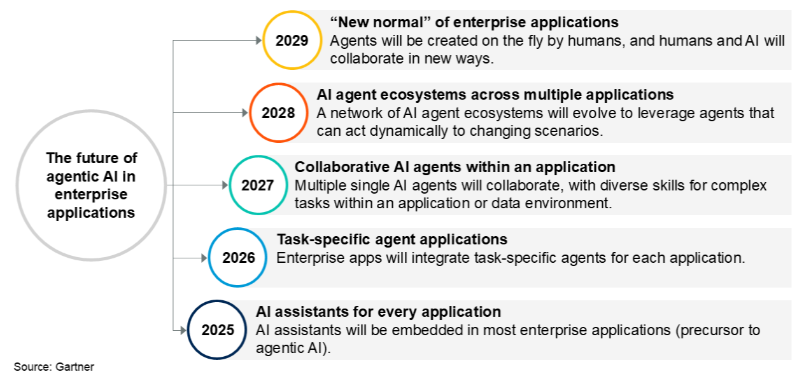

# Relevance of the Topic
## Developments in the AI Industry

* Agentic AI as a moving target
* Agent software has initiated a new phase in AI utilisation
* This phase has profound implications for the work of content professionals
* AI agents in the content sector require governance and standards

## Media Presence

## Vibe-Coding and Agentic AI in the Software Industry

* Example: [OpenClaw — Personal AI Assistant](https://openclaw.ai/)
* Gold rush atmosphere and *vampirism* [@yeggeAIVampire2026]
* Criticism of the risks [@geuterDiffusionResponsibility2026]

## Agentic AI Hype in Marketing

##

{width=50%}

> "As a marketing leader, you have a new AI strategy mandate: leverage your team’s prompting skills to build the hybrid human-agent teams that will ultimately evolve into a super-productive autonomous workforce. The era of the tool operator is ending… It’s the dawn of the agentic frontier." [@AgenticMarketingManaging2026]

# What Is Agentic AI?

## Software Agents as Virtual Employees
* Repetitive tasks are handled by software agents
* Agents are capable of learning and are context-sensitive
* They can be interconnected

## Linking Applications with AI
* Agents take over software control
* This allows entire workflows to be designed and delegated to agents
* Agents can further develop applications

## Developing Agents Using Natural Language
* Agents are available to developers and end users, e.g., [Google Opal](https://developers.google.com/opal "Opal  |  Google for Developers")
* They can be developed without programming skills, at least as prototypes

## Use of Different LLMs
* Agents are not tied to a single LLM
* Models can also be used locally
* Billing is via subscriptions or usage time

## Standardisation
* Open source protocal for connecting software and models: [Model Context Protocol](https://modelcontextprotocol.io/docs/getting-started/intro "What is the Model Context Protocol (MCP)? - Model Context Protocol")
* Example: [Zotero MCP](https://github.com/cookjohn/zotero-mcp "GitHub - cookjohn/zotero-mcp: Zotero MCP Plugin 是一个 Zotero 插件，通过 MCP协议实现 AI 助手与 Zotero深度集成。插件支持文献检索、元 数据管理、全文分析和智能问答等功能，让 Claude、ChatGPT 等 AI 工具能够直接访问和操作您的文献库。 Zotero MCP Plugin enables integration between AI assistants and Zotero through MCP.")

# Examples of Agentic AI

## nexos.ai
* [AI in Marketing: Benefits & Real-World Use Cases | nexos.ai](https://nexos.ai/ai-for-marketing/)
* [AI Agents for any task you imagine](https://nexos.ai/)

## Financial Data as a Podcast
* <https://services.google.com/fh/files/misc/ai_agents_handbook.pdf>

# Corporate and Company Strategies

## Expansion of Google Cloud as an Agent Platform
* [Vertex AI Agent Builder](https://cloud.google.com/products/agent-builder)
* Wide range of offerings
* Integration with Gemini: [Vertex AI vs Gemini: Which One Should You Choose in 2025?](https://www.agiyes.com/aireviews/vertex-ai-vs-gemini/ "Vertex AI vs Gemini: Which One Should You Choose in 2025?" )
* Close linkage with other Google services

## Development of Campaigns and Advertisements as a Service at Facebook
* Service for complete campaigns from 2026 [@sweneyFacebookInstagramOwner2025a]
* Issues in relationships with the advertising industry [@schultzMetaSupportsAgencies2025]

# Forecasts for Agentic AI in Marketing

## Gartner Forecast for Agentic AI

* By the end of 2026: Integration of AI agents in 40% of enterprise applications

## Industry Assessments

* Forbes: The Era of Agentic Marketing has begun [@bhadraEraAgenticMarketing2025]
* Content Marketing Institute [@contentmarketintinstituteteamMarketingSkillThat2026]:

> "As a result, people more frequently seek conversations with real people online to validate what they believe and what to buy. Those interactions compound, influencing search results, AI answers, etc."

# Standards and Governance

## Strategic Development of Agents
* Agent development must be based on strategic analysis
* It is important to delegate precisely defined tasks and plan interfaces
[@BuildAgenticWorkflows2026]

## Human Employees as "Brand Guardians"
* Poorly performing agents can sustainably damage the brand
* Marketing managers must ensure compliance with brand guidelines
* Training agents will become a core marketing task

##

> "The AI agent is a powerful engine, but the human holds the brand's steering wheel and brake. The human's job is to ensure the AI's output is on-brand, ethical and aligned with the company's voice while keeping careful watch for AI hallucinations, aiming to prevent mishaps such as what happened with an Air Canada chatbot that misrepresented corporate policies." [@bhadraEraAgenticMarketing2025]

## Final Remarks

* Problems of privacy, data security and intellectual property
* Platform economy
* Productivity gains and loss of work places
* Growth instead of reduction

# Sources of Information
## Online Expertise
* [AI in Marketing recent news | Content Marketing Institute](https://contentmarketinginstitute.com/strategy-planning/ai-in-marketing "AI in Marketing recent news | Content Marketing Institute")
* [Derek Martin](https://derekfmartin.substack.com/ "Advanced Marketing with Derek Martin | Substack")
* [Amy Balliett](https://amyballiett.com/#/latest-from-the-blog "Latest from the Blog - Amy Balliett")
* ...

## References
