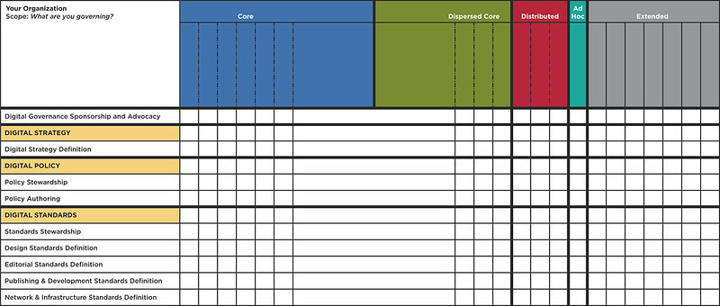

---

title: Institutionalising Editorial Quality

---

 Aufgabe: Wie können wir sicherstellen, dass eine Publikation - als Beispiel: contentstragy.at – nicht als Marketing wahrgenommen wird, sondern als bestmögliche Darstellung ihres Gegenstands?
 
 
# The Business Case for Editorial Quality
 
 
 
 
 
 

 
 
# Editorial Quality and Governance
 

##

##

 
 Was sind die Risiken? Das Hauptrisiko besteht darin, als eine von unzählig vielen Content Marketing Publikationen wahrgenommen zu werden.
 
 accountancy: Ich kann auf Prozesse der Qualitätskontrolle verweisen
 
 welche dieser Prozesse kann ich sinnvollerweise annehmen, wenn es eindeutig um eine interessengeleitete Kommunikation geht. 

Written Standards

Internal quality control

External Watchdogs

Moderation

Editorial quality in journalism

Editorial quality in science and technical publishing

- Peer reviews

Editorial quality in PR

The content strategy approach: Organisation communication is publishing, Organisationskommunikation muss durch die Qualität ihrer Inhalte überzeugen

Ressources: Content strategists as editors, Quality vs. Efficiency, Governance

Der Governance approach: Welche Rollen stellen die Qualität sicher?

Welche Kommunikationsformen gibt es zur Sicherung der Qualität

Externe Absicherungen

- Wissenschaftlichkeit
- Berufsverbände
- Dialogbereitschaft

Cataloguing and standardizing editorial style [@bloomsteinTrustworthyHowSmartest2021, chapter 2]

Cultivation authors with a certain style [@bloomsteinTrustworthyHowSmartest2021, chapter 2]

Tools

- Documentation of all standards [@welchmanManagingChaosDigital2015, Chapter: Digital Policy]

**Editorial**

 

The style of language and the strategy for content delivery and curation.

 

**Branding** (tone, use of company name, use of product names)

 

**Language** (style manual/dictionary, terminology, cultural competence)

 

**Localization** (translation, management, cultural adaptation)
 [@welchmanManagingChaosDigital2015, Chapter: The Power of the Network]
 
 [@welchmanManagingChaosDigital2015, Chapter: Standards Implementation]
 - Implememtation of standards via the CMS 
 - 

> Certain standards, particularly some editorial and design standards, need to be implemented via other means, such as employee training and education.  [@welchmanManagingChaosDigital2015, Chapter: Standards Implementation]

> Editorial standards should be crafted by those with expertise in Web writing and content strategy. Standards related to publishing and development should be written by those who understand Web content management systems technologies _and_ how best to author content so that it can be effectively moved around and delivered by those systems.  [@welchmanManagingChaosDigital2015, Chapter: Identifying Standards Authors]

> **Make a distinction between digital production and digital governance.** Your digital governance framework is just that—a framework for decision making. It should not be applied to day-to-day production. For instance, just because your core digital team might be responsible for establishing editorial standards doesn’t mean that they have to approve every piece of content that goes on the site. It means that the standards author is responsible for defining the substance of the editorial standard and helping to support an environment where those standards are easy to uphold. Don’t confuse the two. You might develop more tactical levels of governance, like content governance or taxonomy governance, but those are different, more production-focused activities than what have been described in this book.  [@welchmanManagingChaosDigital2015, Chapter: At Last: Implementing the Framework]

> _**Content Strategy (Manager)**_

 

• Defines digital content strategy for all digital channels.

 

• Acts as a consultant for projects (rich media development and content).

 

• Defines digital editorial standards.

 

• Oversees digital content strategy.

 

• Manages information architecture.

 

• Serves as a member of the digital university consortium.

 [@welchmanManagingChaosDigital2015, Chapter 11
 
   @page { size: 21cm 29.7cm; margin: 2cm } h2 { line-height: 100%; text-align: left; orphans: 2; widows: 2; margin-top: 0.4cm; margin-bottom: 0.4cm; border: none; padding: 0cm; direction: ltr; background: transparent } h2.western { font-size: 18pt; font-style: normal; font-weight: bold } h2.cjk { font-size: 18pt; font-style: normal; font-weight: bold } h2.ctl { font-size: 18pt } p { line-height: 115%; orphans: 0; widows: 0; margin-bottom: 0.25cm; background: transparent } a:link { color: #000080; so-language: zxx; text-decoration: underline } 

## _Chapter Eleven. The Revision Process_

  

> Editing is the single most important thing you can do to prepare your work for the web.

## Collaborative improvement

> Call out style choices you made, particularly if there are exceptions to your style guide.
  

## Levels of editing and improvement

  
> _You can also avoid getting into back-and-forth discussions about sentence-level decisions by telling your team what kind of comments you want. We like to think in terms of high-level feedback and low-level feedback.
  
 
  

  
## High-level feedback: development editor
  
> High-level feedback answers questions like these:• Is it clear? Does it make sense?• Does it flow? Are there places where you get lost?• Does it cover the most important topics?• Does anything insult your intelligence or go over your head?• Are there places where you need a story or an example?These are the questions that a developmental editor would answer when reviewing your work._
  

## Low-level feedback: copy editor
  

 > Low-level feedback is more granular and includes comments on convoluted phrasing, confusing messages, misspellings, and grammatical errors.

  

  

  > Use the feedback as a reason to have a meaningful discussion about the text. If you’re going to ignore several comments from someone, you may want to explain why you’re not incorporating those changes.

  

  
> give it one more read-through to make sure your tone flows with your overall communication style
  

  
> Is it clear? Is it friendly? Is it useful\_
 
> writers will be more likely to accept your feedback if they feel like they’re part of the editing process.
  
> \_Watch out for recurring issues and themes as you edit. If you see a writer making the same mistake repeatedly or notice several people making a similar one, think about how to teach them a better way. Mention your style guide gently when it’s appropriate.\_

> \_if your style guide doesn’t cover that recurring issue, it’s probably time to update it.\_
  

> As an editor, your job is to help the reader understand what’s being said, not to be the ultimate style enforcer._

  

  

  

  
> Continue developing your editorial process as you work through drafts and reviews.\_
  

  

 
  

  

  

  
  

# Style Guide

  
> A style guide helps writers understand your brand voice and content standards. It’s a living, working guide to writing for your [@fentonNicelySaidWriting2014, chapter 11]

  

  
---
  
> A style guide can highlight content goals, terms to avoid, and common language mistakes. [@fentonNicelySaidWriting2014, chapter 11]

---

> Think of it like a car manual: you might not use it every day, but it’s helpful to have around when questions come up. [@fentonNicelySaidWriting2014, chapter 11]
  

  

  
> It’s not a workbook. Treat your style guide as a reference, not a cure-all. 
  

  

> It’s an important tool that can improve your content, but you’ll need to refine it over time. And you may need to make exceptions once in a while_      January 30, 2023 | [167](http://play.google.com/books/reader?printsec=frontcover&output=reader&id=D3eaAwAAQBAJ&source=books-notes-export&pg=GBS.PA159.w.5.0.3) |

  

  

  > \_For most teams, it makes sense to pick an existing style guide as a foundation and build on it. I\_
  
  > \_Include a few overarching content principles so your team understands the spirit of your style guide.\_

  
> \_If you have brand guidelines, design attributes, or general principles for your communications, you can use those as your content principles.\_

> \_Dig into your company’s personality and include tips for striking the right tone. If you made a This But Not That list (refer to Chapter 5: Find Your Voice), include it as a reference.\_
  

  

  

# Style Guide and Content Types

  

  
> List all of the content types your company publishes (refer to Chapter 3: Make a Plan for a full list). Sort them alphabetically, or try to loosely reflect the order in which people encounter them on your website\_
  

  
> If you have several guidelines for each of your content types, include a section for each entry.\_
  
> Help writers see the subtle differences between the content types
  

  

 > \could include standards for capitalization, abbreviations, acronyms, and other words you want to emphasize.

  

  

  

  

> Alphabetize your list of grammar and usage guidelines so people can skim to the right section._      January 30, 2023 | [172](http://play.google.com/books/reader?printsec=frontcover&output=reader&id=D3eaAwAAQBAJ&source=books-notes-export&pg=GBS.PA164.w.8.0.10) |

  

  
> \_Here are a few things to include:• Titles, headers, and subheaders• Block elements, like block quotes, lists, or code snippets• Image titles, caption length, alt text, and sizes• Text styles: emphasis, italics, footnotes, and so on• Keywords to use, like bookshop, bookstore, and young readers\_
 
> _Wrap up your style guide with a brief list of resources for people who want to learn more about writing. Include a link to your foundational style guide, along with any other books or links that will help your team on a daily basi

> \_In some organizations, a presentation is a great way to talk about style\_
  
> \_A lecture-style talk is useful for introducing yourself and your team,\_
  

> \_Alicia says flash started early in the team’s history: “We wanted to make sure we were all writing in the same voice and the easiest way to do this was to show each other work and talk about it.”\_

> “\_We also participate in design critiques and collaborate with user experience research to make sure we get a wide range of feedback from people outside our team—\_

  
> \_You can do something similar with your colleagues. Set a time for them to meet with you individually and ask you style questions or work through a draft. You could also host group office hours where you help more than one person at a time. I\_

> _ou may want to form an official group for people who are interested in editorial decisions.

> \_A changelog, or list of recent changes, may be useful at the end of your style guide\_

>  | _New York Times does a great job of announcing style changes on their After Deadline blog._      January 30, 2023 | [176](http://play.google.com/books/reader?printsec=frontcover&output=reader&id=D3eaAwAAQBAJ&source=books-notes-export&pg=GBS.PA168.w.9.0.0) |
  

## Literatur

